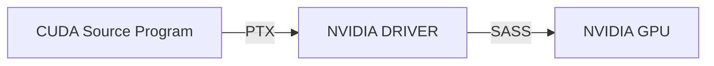

# 1 DeepSeek's Impact on AI
Site: https://www.modular.com/blog/democratizing-compute-part-1-deepseeks-impact-on-ai
Date: 30 January 2025

DeepSeek’s recent breakthrough has upended assumptions about AI’s compute demands, showing that **better hardware utilization** can dramatically reduce the need for expensive GPUs.
>  DeepSeek 的最近突破颠覆了关于 AI 计算需求的假设，表明了更好的硬件利用率可以显著减少对昂贵 GPU 的需求

For years, leading AI companies have insisted that **only those with** [**vast compute resources**](https://www.bbc.com/news/articles/cy4m84d2xz2o) can drive cutting-edge research, reinforcing the idea that it is “[hopeless to catch up](https://www.youtube.com/watch?v=EtMsG2UtMUU)” unless you have billions of dollars to spend on infrastructure. But DeepSeek’s success tells a different story: **novel ideas can unlock efficiency breakthroughs to accelerate AI**, and smaller, highly focused teams to **challenge industry giants–** and even level the playing field.
>  多年来，领先的 AI 公司一直坚信只有拥有大量计算资源的公司可以推动前沿研究
>  但 DeepSeek 的成功则说明: 创新的想法可以带来效率的突破，并且小型而专注的团队也能挑战行业巨头，甚至实现公平竞争

We believe DeepSeek’s efficiency breakthrough signals a **coming surge in demand** for AI applications. If AI is to continue advancing, we must **drive down the Total Cost of Ownership (TCO)**–by expanding access to alternative hardware, maximizing efficiency on existing systems, and accelerating software innovation. Otherwise, we risk a future where AI’s benefits are **bottlenecked**–either by **hardware shortages** or by developers struggling to effectively utilize the diverse hardware that is available.
>  我们认为 DeepSeek 在效率上的突破预示着对 AI 应用的需求将大幅增长
>  如果 AI 要进步，我们需要降低总体拥有成本 —— 通过扩大对替代硬件的访问、最大化现有系统的效率，加速软件创新
>  否则，我们可以面临未来 AI 被瓶颈限制，要么是硬件短缺，要么是开发者难以利用多样化的硬件

This isn’t just an abstract problem–it's a challenge I’ve spent my career working to solve.

## My passion for compute + developer efficiency
I've spent the past 25 years working to unlock computing power for the world. I founded and led the development of [LLVM](https://en.wikipedia.org/wiki/LLVM), a compiler technology that opened CPUs to new applications of compiler technology. Today, LLVM is the foundation for performance-oriented programming languages like C++, Rust, Swift and more. It powers nearly all iOS and Android apps, as well as the infrastructure behind major internet services from Google and Meta.

This work paved the way for several key innovations I led at Apple, including the creation of [OpenCL](https://en.wikipedia.org/wiki/OpenCL), an early accelerator framework now widely adopted across the industry, the rebuild of Apple’s CPU and GPU software stack using LLVM, and the development of the [Swift programming language](https://en.wikipedia.org/wiki/Swift_\(programming_language\)). These experiences reinforced my belief in the power of shared infrastructure, the importance of co-designing hardware and software, and how intuitive, developer-friendly tools unlock the full potential of advanced hardware.

## Falling in love with AI
In 2017, I became fascinated by AI’s potential and joined Google to lead software development for the TPU platform. At the time, the hardware was ready, but the software wasn’t functional. Over the next two and a half years, through intense team effort, we launched [TPUs in Google Cloud](https://cloud.google.com/tpu), scaled them to ExaFLOPS of compute, and built a research platform that enabled breakthroughs like [_Attention Is All You Need_](https://en.wikipedia.org/wiki/Attention_Is_All_You_Need) and [BERT](https://en.wikipedia.org/wiki/BERT_\(language_model\)).

Yet, this journey revealed deeper troubles in AI software. Despite TPUs' success, they remain only semi-compatible with AI frameworks like PyTorch–an issue Google overcomes with vast economic and research resources. A common customer question was, **“Can TPUs run arbitrary AI models out of the box?”** The hard truth? **No–because we didn’t have CUDA, the de facto standard for AI development.**
>  尽管 TPU 取得了成功，但它们与 PyTorch 等 AI 框架的兼容性仍然有限，Google 用了大量的经济和研究资源解决了这一问题
>  一个常见的客户问题是: TPU 能否开箱即用地运行任意 AI 模型
>  答案是不能，因为我们没有 CUDA —— AI 开发的事实标准

I’m not one to shy away from tackling major industry problems: my recent work has been the creation of next-generation technologies to scale into this new era of hardware and accelerators. This includes the MLIR compiler framework (widely adopted now for AI compilers across the industry) and the Modular team has spent the last 3 years building something special–but we’ll share more about that later, when the time is right.
>  笔者最近的工作就是开发下一代技术，以适应这个新的硬件和加速器时代

## How do GPUs and next-generation compute move forward?
Because of my background and relationships across the industry, I’m often asked about the future of compute. Today, countless groups are innovating in hardware (fueled in part by NVIDIA’s soaring market cap), while many software teams are adopting MLIR to enable new architectures. At the same time, senior leaders are questioning why–despite massive investments–the AI software problem remains unsolved. The challenge isn’t a lack of motivation or resources. So why does the industry feel stuck?
>  如今，无数团队正在硬件领域进行创新，同时许多软件团队正在采用 MLIR 在支持新的架构
>  于此同时，领导者也在质疑为什么投入巨大，AI 软件问题仍然没有解决，如果问题不是缺乏资源和动力，为什么整个行业会陷入停滞

I don’t believe we _are_ stuck. But we do face difficult, foundational problems.
>  笔者不认为我们被困住了，但我们确实面临一些困难而基础性的问题

To move forward, we need to better understand the underlying industry dynamics. Compute is a deeply technical field, evolving rapidly, and filled with jargon, codenames, and press releases designed to make every new product sound revolutionary. Many people try to cut through the noise to _see the_ [_forest for the trees_](https://en.wiktionary.org/wiki/see_the_forest_for_the_trees), but to truly understand where we’re going, we need to examine the _roots_—the fundamental building blocks that hold everything together.
>  为了理解我们前进的方向，我们需要审视根源 —— 那些支撑一切的基本构建模块

This post is the first in a multipart series where we’ll help answer these critical questions in a straightforward, accessible way:

- 🧐 What exactly is CUDA?
- 🎯 Why has CUDA been so successful?
- ⚖️ Is CUDA any good?
- ❓ Why do other hardware makers struggle to provide comparable AI software?
- ⚡ Why haven’t existing technologies like Triton or OneAPI or OpenCL solved this?
- 🚀 How can we as an industry move forward?

>  这个系列将回答以下关键问题:
>  - CUDA 是什么
>  - 为什么 CUDA 这么成功
>  - CUDA 真的好吗
>  - 为什么其他硬件厂商难以提供可比的 AI 软件
>  - 为什么现有的技术如 Triton, OneAPI, OpenCL 未能解决这个问题
>  - 我们整个行业该如何向前推进

I hope this series sparks meaningful discussions and raises the level of understanding around these complex issues. The rapid advancements in AI —like DeepSeek’s recent breakthroughs–remind us that software and algorithmic innovation are still driving forces. A deep understanding of low-level hardware continues to unlock "10x" breakthroughs.
>  AI 的快速进步，比如 DeepSeek 最近的突破，提醒我们软件和算法的创新让然是推动发展的核心力量，同时对底层硬件的深入理解仍然能够带来 “10 倍” 级别的突破

AI is advancing at an unprecedented pace–but **there’s still so much left to unlock**. Together we can break it down, challenge assumptions, and push the industry forward. **Let’s dive in!**

-Chris

# 2 What exactly is “CUDA”? 
Site: https://www.modular.com/blog/democratizing-compute-part-2-what-exactly-is-cuda
Date: 5 February 2025

It seems like **everyone** has started talking about [CUDA](https://en.wikipedia.org/wiki/CUDA) in the last year: It’s the **backbone of deep learning,** the reason **novel hardware struggles to compete,** and the core of **NVIDIA’s moat** and **soaring market cap.** With DeepSeek, we got a startling revelation: its **breakthrough was made possible by “bypassing” CUDA**, [going directly to the PTX layer](https://www.tomshardware.com/tech-industry/artificial-intelligence/deepseeks-ai-breakthrough-bypasses-industry-standard-cuda-uses-assembly-like-ptx-programming-instead) … but what does this actually mean? It feels like everyone wants to break past the lock-in, but we have to **understand what we’re up against** before we can formulate a plan.
>  过去一年里，所有人都开始讨论 CUDA: 它是 DL 的基石，是新硬件难以竞争的原因，也是 NVIDIA 护城河和市值飙升的核心
>  DeepSeek 的启示是: 它的突破是通过 “绕过” CUDA 实现的，直接进入 PTX 层
>  但这到底意味着什么呢？在制定计划之前，我们需要了解我们面对的是什么

CUDA’s dominance in AI is undeniable—but **most people don’t fully understand what CUDA actually is**. Some think it’s a programming language. Others call it a framework. Many assume it’s just **“that thing NVIDIA uses to make GPUs faster.”** None of these are entirely wrong—and many [brilliant people are trying to explain this](https://x.com/IanCutress/status/1884374138787357068) —but none capture the **full scope of “The CUDA Platform.”**
>  CUDA 在 AI 领域的主导地位无可争议，但大多数人并不完全理解 CUDA 到底是什么

CUDA is not just one thing. It’s a **huge, layered Platform**—a collection of technologies, software libraries, and low-level optimizations that together form a **massive parallel computing ecosystem**. It includes:

- **A low-level parallel programming model** that allows developers to harness the raw power of GPUs with a C++-like syntax.
- **A complex set of libraries and frameworks**—middleware that powers crucial vertical use cases like AI (e.g., cuDNN for PyTorch and TensorFlow).
- **A suite of high-level solutions** like TensorRT-LLM and Triton, which enable AI workloads (e.g., LLM serving) without requiring deep CUDA expertise.

…and that’s just scratching the surface.

>  CUDA 不是一个东西，而是一个庞大且分层的平台 —— 由一系列技术、软件库和底层优化组成，共同构成了一个庞大的并行计算生态系统，它包括:
>  - 一种底层并行编程模型，允许开发者使用类似 C++ 的语法为 GPU 编写 kernel
>  - 一套复杂的库和框架 —— 即中间件，用于支持关键的垂直应用场景，例如用于 PyTorch, TensorFlow 的 cuDNN
>  - 一系列高级解决方案，例如 TensorRT-LLM 和 Triton，使得 AI workload 可以在不需要深入 CUDA 的情况下实现
>  这些仅仅是冰山一角

>  个人把 CUDA 看作一个对 NVIDIA GPU 的编程接口以及支持这个接口的一整套工具链，大致包括:
>  - 编译器 NVCC 和 IR PTX
>  - 库 cuDNN, cuBLAS, cuFFT
>  - 调试器 cuda-GDB 和性能分析器 NSight
>  这个编程接口对程序员提供的编程抽象是 SIMT，这个统一的编程模型将 GPU 内部的上千个核心整合起来，在 GPU 架构上进行计算任务，因此 CUDA 叫做计算统一的设备架构 (虽然实际上并不是一个设备架构，是利用设备架构的工具)
>  当然实际上基于 CUDA 之上的东西也属于 CUDA 生态系统的一部分

In this article, we’ll break down the **key layers of the CUDA Platform**, explore its **historical evolution**, and explain **why it’s so integral to AI computing today**. This sets the stage for the next part in our series, where we’ll dive into **why CUDA has been so successful.** Hint: it has a lot more to do with market incentives than it does the technology itself.
>  CUDA 的成功更多和市场激励有关，而不仅仅是技术本身

Let’s dive in. 🚀

## The Road to CUDA: From Graphics to General-Purpose Compute
Before GPUs became the powerhouses of AI and scientific computing, they were **graphics processors—specialized processors for rendering images**. Early GPUs **hardwired** image rendering into silicon, meaning that every step of rendering (transformations, lighting, rasterization) was fixed. While efficient for graphics, these chips were **inflexible**—they couldn’t be repurposed for other types of computation.
>  AI 之前，GPU 是专用于图像渲染的处理器
>  早期 GPU 将图像渲染硬编码到硅芯片中，这意味着渲染的每一步 (变换、光照、光栅化) 都是固定的
>  这样的图片处理效率高，但芯片缺乏灵活性

Everything changed in **2001** when NVIDIA introduced the **GeForce3**, the first GPU with **programmable shaders**. This was a **seismic shift** in computing:

- 🎨 **Before:** Fixed-function GPUs could only apply pre-defined effects.
- 🖥️ **After:** Developers could **write their own shader programs**, unlocking **programmable graphics pipelines**.

This advancement came with **Shader Model 1.0**, allowing developers to write **small, GPU-executed programs** for vertex and pixel processing. NVIDIA saw **where the future was heading:** instead of just improving graphics performance, GPUs could become **programmable parallel compute engines**.

>  2001 年 NVIDIA 推出了首款具有可编程着色器的 GPU GeForece3，这是计算领域的重大变革:
>  - 之前: 固定功能的 GPU 只能应用预定义的效果
>  - 之后: 开发者可以编写自己的着色器程序
>  这一进步带来了 Shader Model 1.0，允许开发者编写小型的、可以在 GPU 上执行的程序，用于顶点和像素处理
>  NVIDIA 看到了未来的发展方向: 除了提升图形性能之外，GPU 可以成为**可编程的并行计算引擎**

At the same time, it didn’t take long for researchers to ask:

> “🤔 _If GPUs can run small programs for graphics, could we use them for non-graphics tasks?”_

One of the first serious attempts at this was the [**BrookGPU project**](http://graphics.stanford.edu/projects/brookgpu/) at Stanford. Brook introduced a programming model that let **CPUs offload compute tasks to the GPU**—a key idea that [set the stage for CUDA](https://www.nvidia.com/content/GTC/documents/1001_GTC09.pdf).

This move was **strategic and transformative**. Instead of treating compute as a **side experiment**, NVIDIA **made it a first-class priority**, embedding CUDA deeply into **its hardware, software, and developer ecosystem**.

>  于此同时，研究人员很快开始好奇 GPU 是否可以用于非图形任务
>  对这一问题最早的尝试是 BrookGPU 项目，Brook 引入了一个编程模型，使得 **CPU 能够将计算任务卸载到 GPU** —— 这是一个关键的概念，为 CUDA 的出现奠定了基础

## The CUDA Parallel Programming Model
In **2006**, NVIDIA launched **CUDA (”Compute Unified Device Architecture”)**—the first **general-purpose programming platform for GPUs**. The CUDA programming model is made up of two different things: the “CUDA programming language”, and the “NVIDIA Driver”.
>  NVIDIA 在 2006 年发布 CUDA —— 第一个面向 GPU 的通用目的编程平台
>  CUDA 编程模型包含两个东西: CUDA 语言、NVIDIA 驱动器


CUDA is a Layered Stack Requiring Deep Integration from Driver to Kernel

The CUDA language is derived from C++, with enhancements to directly expose low-level features of the GPU—e.g. its ideas of “GPU threads” and memory. A programmer can use this language to define a “CUDA Kernel”—an independent calculation that runs on the GPU. A very simple example is:
>  CUDA 语言基于 C++，添加了能够暴露 GPU 低级特性的语法 —— 例如 GPU 线程的思想、GPU memory 的思想
>  程序员用 CUDA 语言定义 CUDA kernel —— 在 GPU 上运行的独立计算单元

```cpp
__global__ void addVectors(float *a, float *b, float *c, int n) {
    int idx = threadIdx.x + blockIdx.x * blockDim.x;
    if (idx < n) {
        c[idx] = a[idx] + b[idx];
    }
}
```

CUDA kernels allow programmers to define a custom computation that accesses local resources (like memory) and using the GPUs as very fast parallel compute units. This language is translated (”compiled”) down to “PTX”, which is an assembly language that is the lowest level supported interface to NVIDIA GPUs.
>  CUDA 语言为将 GPU 作为非常快速的并行计算单元提供了接口
>  CUDA 程序会被编译为 PTX，是 NVIDIA GPU 支持的最低级别接口 (SASS 就不算接口了，因为它不对外暴露)

But how does a program **actually execute code on a GPU?** That’s where the **NVIDIA Driver** comes in. It acts as the **bridge** between the CPU and the GPU, handling memory allocation, data transfers, and kernel execution. A simple example is:
>  编译好的程序如何在 GPU 上执行呢？
>  这是 NVIDIA 驱动器的任务，它是 CPU 和 GPU 之间的桥梁，处理内存分配、数据传输、kernel 执行 (CPU 通过 NVIDIA 驱动和 GPU 交互)

>  也就是说，通常我们用的 CUDA API 例如 `cudaMalloc, cudaMemcpy` 都属于 CUDA Runtime API，它实际上是 CUDA Driver API 上的一层封装
>  驱动程序提供的就是 CUDA Driver API，驱动才是真正直接与 GPU 硬件通信的主体
>  当然必要情况下，程序员是可以直接调用 CUDA Driver API 的

>  无论是 CUDA Runtime API 还是 CUDA Driver API，都属于源码层次，最终都会被编译
>  CUDA 代码被编译后，会先生成 PTX IR，注意 PTX 是一个独立于 GPU 硬件架构的语言，因此 CUDA -> PTX 只是 NVCC 前端编译的流程
>  驱动程序接收 PTX IR，并使用内置的即时编译器，将 PTX IR 进一步编译为特定于 GPU 架构的 SASS 机器码
>  GPU 硬件接收到驱动编好的 SASS，进而执行



```cpp
cudaMalloc(&d_A, size);
cudaMalloc(&d_B, size);
cudaMalloc(&d_C, size);

cudaMemcpy(d_A, A, size, cudaMemcpyHostToDevice);
cudaMemcpy(d_B, B, size, cudaMemcpyHostToDevice);

int threadsPerBlock = 256;
// Compute the ceiling of N / threadsPerBlock
int blocksPerGrid = (N + threadsPerBlock - 1) / threadsPerBlock;
addVectors<<<blocksPerGrid, threadsPerBlock>>>(d_A, d_B, d_C, N);

cudaMemcpy(C, d_C, size, cudaMemcpyDeviceToHost);

cudaFree(d_A);
cudaFree(d_B);
cudaFree(d_C);
```

Note that all of this is very low level—full of fiddly details (e.g. pointers and “magic numbers”). If you get something wrong, you’re most often informed of this by a difficult to understand crash. Furthermore, CUDA exposes a lot of details that are specific to NVIDIA hardware—things like the “number of threads in a warp” (which we won't explore here).

Despite the challenges, these components enabled an entire generation of hardcore programmers to get access to the huge muscle that a GPU can apply to numeric problems. For example, the [**AlexNET**](https://en.wikipedia.org/wiki/AlexNet) **ignited modern deep learning in 2012**. It was made possible by custom CUDA kernels for AI operations like convolution, activations, pooling and normalization and the horsepower a GPU can provide.
>  这些组件使得程序员可以利用 GPU 的算力，AlexNet 点燃了现代深度学习，它得益于为 AI 运算例如卷积、池化、规范化定制的 CUDA kernel 以及 GPU 提供的算力

While the CUDA language and driver are **what most people typically think of** when they hear “CUDA,” this is far from the whole enchilada—it’s just the **filling inside**. Over time, **the CUDA Platform** grew to include much more, and as it did, the meaning of the original acronym fell away from being a useful way to describe CUDA.
>  虽然 CUDA 语言和驱动程序是大多数人听到 “CUDA” 时想到的内容，但这远不是全部
>  随着其发展，CUDA 平台逐渐包含了更多内容，且原始缩写 CUDA 也不能准确描述整个 CUDA

## High-Level CUDA Libraries: Making GPU Programming More Accessible
The CUDA programming model opened the door to **general-purpose GPU computing and is powerful**, but it brings two challenges:

1. CUDA is **difficult to use**, and even worse...
2. CUDA doesn’t help with **performance portability**

Most kernels written for generation N will “keep working” on generation N+1, but often the performance is quite bad—far from the peak of what N+1 generation can deliver, even though GPUs are all about performance. This makes CUDA a **strong tool for expert engineers**, but a **steep learning curve for most developers.** But is also means that significant rewrites are required every time a new generation of GPU comes out (e.g. Blackwell is now emerging).

>  CUDA 编程模型打开了通用目的 GPU 计算的大门，但也带来了两个挑战:
>  1. CUDA 难写
>  2. CUDA 不能帮助实现性能的可移植性
>  大多数为第 N 代编写的 kernel 在 N+1 代 GPU 上仍然可以运行，但性能往往远低于 N+1 代的峰值性能，这意味着，每当新一代 GPU 出现时，都需要进行大量的重写工作

As NVIDIA grew it wanted GPUs to be useful to people who were domain experts in their own problem spaces, but weren’t themselves GPU experts. NVIDIA’s solution to this problem was to start building rich and complicated **closed-source, high-level libraries** that abstract away low-level CUDA details. These include:

- **cuDNN** (2014) – Accelerates deep learning (e.g., convolutions, activation functions).
- **cuBLAS** – Optimized linear algebra routines.
- **cuFFT** – Fast Fourier Transforms (FFT) on GPUs.
- … and [many others](https://developer.nvidia.com/gpu-accelerated-libraries).

>  为了让非专家也能使用 CUDA, NVIDIA 构建了丰富且复杂的闭源高级库，抽象了底层 CUDA 的细节，其中包括:
>  - cuDNN —— 加速深度学习，例如卷积，激活函数
>  - cuBLAS —— 加速线性代数运算
>  - cuFFT—— GPU 上进行 FFT

With these libraries, developers could **tap into CUDA’s power without needing to write custom GPU code**, with NVIDIA taking on the burden of **rewriting these for every generation of hardware**. This was a big investment from NVIDIA, **but it worked**.
>  NVIDIA 承担了为每一代硬件重写这些库的负担，上层的开发者则无需编写自定义的 GPU 代码就能利用 CUDA
>  这对 NVIDIA 是一项巨大的投资，但效果很好

The **cuDNN library** is especially important in this story—it paved the way for Google’s **TensorFlow** (2015) and Meta’s **PyTorch** (2016), enabling deep learning frameworks to take off. While there were earlier AI frameworks, these were the first frameworks to truly scale—modern AI frameworks now have **_thousands_** of these CUDA kernels and each is very difficult to write. As AI research exploded, NVIDIA aggressively pushed to expand these libraries to cover the important new use-cases.
>  cuDNN 库在这个故事中尤为重要，它为 Google 的 TensorFlow 和 Meta 的 PyTorch 铺平了道路，使得 DL 框架可以迅速发展
>  如今的 DL 框架中有数千个这样的 CUDA kernel, NVIDIA 也积极推动这些库，以覆盖越来越多的场景


PyTorch on CUDA is Built on Multiple Layers of Dependencies

NVIDIA’s investment into these **powerful GPU libraries** enabled the world to focus on building high-level AI frameworks like PyTorch and developer ecosystems like HuggingFace. Their next step was to make entire **solutions** that could be used **out of the box**—without needing to understand the CUDA programming model at all.
>  NVIDIA 对这些 GPU 库的投资使得全球开发者可以专注于构建像 PyTorch 这样的高级框架，以及 HuggingFace 这样的开发生态
>  它们的下一步是打造完整的解决方案，这些方案开箱即用 —— 完全不需要理解 CUDA 编程模型

## Fully vertical solutions to ease the rapid growth of AI and GenAI
The AI boom went far beyond research labs—**AI is now everywhere**. From **image generation** to **chatbots**, from **scientific discovery** to **code assistants**, **Generative AI (GenAI) has exploded across industries**, bringing a flood of new applications and developers into the field.

At the same time, **a new wave of AI developers emerged, with very different needs.** In the early days, deep learning required **highly specialized engineers** who understood CUDA, HPC, and low-level GPU programming. Now, a new breed of developer—often called **AI engineers**—is building and deploying AI models without needing to touch low-level GPU code.
>  如今的 AI 工程师在构建和部署 AI 模型时，不需要接触底层的 GPU 代码

To meet this demand, NVIDIA went beyond just providing libraries—it now offers **turnkey solutions** that abstract away **everything** under the hood. Instead of requiring **deep CUDA expertise**, these frameworks allow AI developers to **optimize and deploy models with minimal effort**.

- **Triton Serving** – A high-performance serving system for AI models, allowing teams to efficiently run inference across multiple GPUs and CPUs.
- **TensorRT** – A deep learning inference optimizer that **automatically tunes models** to run efficiently on NVIDIA hardware.
- **TensorRT-LLM** – An even more specialized solution, built for **large language model (LLM) inference at scale**.
- … plus many (many) other things.

>  这是因为，NVIDIA 不再仅仅提供库工具 —— 它现在提供一站式解决方案，将所有底层细节都抽象掉了，开发者不再需要 CUDA 知识，AI 开发者可以以最小的努力优化和部署模型
>  - Triton Serving —— 一个高性能的 AI 模型服务系统，允许团队在多个 GPUs 上和 CPUs 上高效地运行推理
>  - TensorRT —— 深度学习推理优化器，自动调整模型使得能在 NVIDIA 硬件上高效运行
>  - TensorRT-LLM —— 专门为 LLM 大规模推理而设计的优化器


Several Layers Exist Between NVIDIA Drivers and TensorRT-LLM

These tools **completely shield AI engineers from CUDA’s low-level complexity**, letting them **focus on AI models and applications, not hardware details**. These systems provide significant leverage which has enabled the horizontal scale of AI applications.
>  这些工具完全屏蔽了 AI 工程师对 CUDA 底层复杂性的接触，使得他们可以专注于 AI 模型和应用，而不是硬件细节

## The “CUDA Platform” as a whole
CUDA is often thought of as a **programming model**, a **set of libraries**, or even just **"that thing NVIDIA GPUs run AI on."** But in reality, **CUDA is much more than that**—it is a **unifying brand, a truly vast collection of software, and a highly tuned ecosystem**, all deeply integrated with NVIDIA’s hardware. For this reason, the term “CUDA” is ambiguous—we prefer the term “The CUDA Platform” to clarify that we’re talking about something closer in spirit to the Java ecosystem, or even an operating system, than merely a programming language and runtime library.
>  CUDA 通常被看作一个编程模型，一组库
>  事实上，CUDA 是一个统一的品牌，一个庞大的软件集合和一个高度优化的生态系统，与 NVIDIA 的硬件深度集成
>  因此 “CUDA 平台” 更加准确，因为我们讨论的不仅仅是编程模型和运行时库


CUDA’s Expanding Complexity: A Multi-Layered Ecosystem Spanning Drivers, Languages, Libraries, and Frameworks

At its core, the CUDA Platform consists of:

- **A massive codebase** – Decades of optimized GPU software, spanning everything from matrix operations to AI inference.
- **A vast ecosystem of tools & libraries** – From **cuDNN for deep learning** to **TensorRT for inference**, CUDA covers an **enormous range of workloads**.
- **Hardware-tuned performance** – Every CUDA release is deeply optimized for **NVIDIA’s latest GPU architectures**, ensuring top-tier efficiency.
- **Proprietary and opaque** – When developers interact with CUDA’s **library APIs**, much of what happens under the hood is **closed-source and deeply tied to NVIDIA’s ecosystem**.

>  本质上，CUDA 平台包含了:
>  - 庞大的代码库 —— 数十年来针对 GPU 的优化软件，涵盖了从矩阵运算到 AI 推理的各种任务
>  - 丰富的工具和库生态系统 —— 从用于 DL 的 cuDNN 到用于推理的 TensorRT, CUDA 覆盖了广泛的 workloads
>  - 针对硬件的高性能优化 —— 每次 CUDA 发布都会深度优化以适配 NVIDIA 的最新 GPU 架构，确保顶级的效率
>  - 专有且不透明 —— 开发者使用 CUDA 的库 API 时，很多底层操作时闭源的，并且与 NVIDIA 生态系统深度绑定

CUDA is a powerful but sprawling set of technologies—**an entire software platform that sits at the foundation of modern GPU computing**, even going beyond AI specifically.
>  CUDA 是一个完整的软件平台，构成了现代 GPU 计算的基础

Now that we know what “CUDA” is, we need to understand how it got to be so successful. Here’s a hint: CUDA’s success isn’t really about **performance**—it’s about **strategy, ecosystem, and momentum**. In the next post, we’ll explore what enabled NVIDIA’s CUDA software to shape and entrench the modern AI era.
>  CUDA 的成功并不真正在于性能，而是关于策略、生态和势头

See you next time. 🚀

-Chris

# 3 How did CUDA succeed? 
Site: https://www.modular.com/blog/democratizing-ai-compute-part-3-how-did-cuda-succeed
Date: 12 Feb 2025

If we as an ecosystem hope to make progress, we need to understand how **the CUDA software empire** became so dominant. On paper, alternatives exist—AMD’s ROCm, Intel’s oneAPI, SYCL-based frameworks—but in practice, CUDA remains the **undisputed king of GPU compute**.
>  CUDA 存在许多替代方案: AMD ROCm, Intel oneAPI, SYCL-based 框架
>  但 CUDA 仍然是 GPU 计算领域的王者

**How did this happen?**

The answer isn’t just about **technical excellence**—though that plays a role. CUDA is a developer platform built through **brilliant execution, deep strategic investment, continuity, ecosystem lock-in,** and, of course, a little **bit of luck**.
>  CUDA 是通过卓越的执行力、深入的战略投资、持续性、生态系统的绑定而构建出的开发者平台

This post breaks down **why CUDA has been so successful**, exploring the layers of NVIDIA’s strategy—from its early bets on generalizing parallel compute to the tight coupling of AI frameworks like [PyTorch](https://pytorch.org/) and [TensorFlow](http://tensorflow.org/). Ultimately, CUDA’s dominance is not just a triumph of software but a **masterclass in long-term platform thinking**.
>  本文探讨 NVIDIA 战略的各个层面 —— 从早期对并行计算通用化的押注，到与 PyTorch, TensorFlow 的紧密集成
>  CUDA 的成功更像是长期平台思维的典范课

Let’s dive in. 🚀

## The Early Growth of CUDA
A key challenge of building a compute platform is attracting developers to learn and invest in it, and it is **hard to gain momentum** if you can only target niche hardware. In [a great “Acquired” podcast](https://www.acquired.fm/episodes/jensen-huang), Jensen Huang shares that a key early NVIDIA strategy was to keep their GPUs compatible across generations. This enabled NVIDIA to leverage its install base of already widespread **gaming GPUs**, which were sold for running DirectX-based PC games. Furthermore, it enabled developers to learn CUDA on low-priced desktop PCs and scale into more powerful hardware that commanded high prices.
>  构建计算平台的关键挑战是吸引开发者学习并投资，如果只能针对小众硬件，很难积累势头
>  NVIDIA 早期的一个关键策略是保持 GPU 在不同代际之间的兼容性，使得 NVIDIA 能够利用它已经广泛部署的游戏 GPU 市场
>  游戏 GPU 主要用于运行基于 DirectX 的 PC 游戏


This might seem obvious now, but at the time it was a bold bet: instead of creating separate product lines optimized for different use-cases (laptops, desktops, IoT, datacenter, etc.), NVIDIA built a **single contiguous GPU product line.** This meant accepting trade-offs—such as power or cost inefficiencies—but in return, it created a **unified ecosystem** where every developer’s investment in CUDA could scale seamlessly from gaming GPUs to high-performance datacenter accelerators. This strategy is quite analogous to how Apple maintains and drives its iPhone product line forward.
>  在当时看来，这是一个赌注: NVIDIA 没有为专门的使用场景 (例如笔记本、台式机、物联网、数据中心等) 创造新的产品线，而是打造了单独一条连续的 GPU 茶品线
>  这意味着接收一些权衡 —— 比如功耗或成本上的低效率 —— 但回报是构建了一个统一的生态系统，使得每个开发者对 CUDA 的投入都能无缝地从游戏 GPU 扩展到高性能数据中心加速器

The benefits of this approach were twofold:

1. **Lowering Barriers to Entry** – Developers could learn CUDA using the GPUs they already had, making it easy to experiment and adopt.
2. **Creating a Network Effect** – As more developers started using CUDA, more software and libraries were created, making the platform even more valuable.

>  这个方法的好处有两个:
>  1. 降低入门门槛: 开发者使用已有的 CUDA 知识，不需要新学习
>  2. 形成网络效应: 随着更多开发者加入，更多软件和库被创造，平台更有价值

This early install base allowed CUDA to grow beyond gaming into **scientific computing, finance, AI, and high-performance computing (HPC)**. Once CUDA gained traction in these fields, its advantages over alternatives became clear: **NVIDIA’s continued investment ensured that CUDA was always at the cutting edge of GPU performance**, while competitors struggled to build a comparable ecosystem.
>  一旦 CUDA 在其他领域获得认可，它相对于其他方案的优势就显而易见了: NVIDIA 持续的投资确保了 CUDA 始终处于 GPU 性能的最前沿，而竞争对手则难以构建类似的生态系统

## Catching and Riding the Wave of AI Software
CUDA’s dominance was cemented with the **explosion of deep learning**. In 2012, [**AlexNet**](https://en.wikipedia.org/wiki/AlexNet), the neural network that **kickstarted the modern AI revolution**, was trained using two NVIDIA GeForce GTX 580 GPUs. This breakthrough not only demonstrated that **GPUs were faster at deep learning**—it proved they were essential for AI progress and led to **CUDA’s rapid adoption as the default compute backend** for deep learning.
>  AlexNet 在两块 NVIDIA GeForce GTX 580 上训练得到，这证明了 GPU 在深度学习中训练更快，使得 CUDA 很快成为深度学习的**默认后端**

As deep learning frameworks emerged—most notably **TensorFlow** (Google, 2015) and **PyTorch** (Meta, 2016)—NVIDIA **seized the opportunity** and invested heavily in optimizing its **High-Level CUDA Libraries** to ensure these frameworks ran as efficiently as possible on its hardware. Rather than leaving **AI framework teams** to handle **low-level CUDA performance tuning** themselves, NVIDIA took on the burden by aggressively refining **cuDNN** and **TensorRT** as we [discussed in Part 2](https://www.modular.com/blog/democratizing-compute-part-2-what-exactly-is-cuda).
>  随着深度学习框架的兴起，NVIDIA 投资并抓住了机会，大力优化高级 CUDA 库，确保这些框架可以尽可能在其硬件上高效运行
>  NVIDIA 没有让 AI 框架团队自行处理底层 CUDA 性能调优，而是**主动承担起这一责任**，积极改进 cuDNN 和 TensorRT

This move not only made **PyTorch and TensorFlow significantly faster** on NVIDIA GPUs—it also allowed NVIDIA to **tightly integrate its hardware and software** (a process known as “[hardware/software co-design](https://towardsdatascience.com/how-to-co-design-software-hardware-architecture-for-ai-ml-in-a-new-era-b296f2842fe2/)”) because it reduced coordination with Google and Meta. Each major new generation of hardware would come out with a **new version of CUDA** that **exploited the new capabilities** of the hardware. The AI community, eager for speed and efficiency, was more than willing to **delegate this responsibility to NVIDIA**—which directly led to these frameworks being **tied to NVIDIA hardware**.
>  这一举动不仅让 PyTorch 和 TensorFlow 在 NVIDIA GPU 上显著提速，也让 NVIDIA 能够紧密地结合其软件和硬件，因为减少了与 Google 和 Meta 的协调工作
>  每一代新的硬件发布时，都会配套推出一个能够充分利用新硬件功能的 CUDA
>  AI 社区渴望速度和效率，故愿意将这一责任交给 NVIDIA —— 这直接导致了这些框架和 NVIDIA 硬件深度绑定


But why did Google and Meta let this happen? The reality is that **Google and Meta** weren’t singularly focused on building a broad AI hardware ecosystem—they were focused on using AI to **drive revenue, improve their products, and unlock new research**. Their top engineers prioritized **high-impact internal projects** to move internal company metrics. For example, these companies [**decided to** **build**](https://thechipletter.substack.com/p/googles-first-tensor-processing-unit) their own [**proprietary TPU chips**](https://cloud.google.com/transform/ai-specialized-chips-tpu-history-gen-ai) —pouring their effort into optimizing for their own [first-party hardware.](https://ai.meta.com/blog/next-generation-meta-training-inference-accelerator-AI-MTIA/) It made sense to **give the reins to NVIDIA** for GPUs.
>  为什么 Google, Meta 允许这种情况发生呢，现实是 Google 和 Meta 并没有专注于构建一个广泛的 **AI 硬件生态系统** —— 他们关注的是利用 AI 来推动收入、提升产品和解锁新研究
>  它们的顶尖工程师优先考虑的是高影响力的内部项目，以提升公司内部的指标，例如，这些公司决定自己开发专有的 TPU 芯片，并将经历投入到优化自己的**第一方硬件上**
>  这在当时是合理的，即让 NVIDIA 负责 GPU 的发展

Makers of alternative hardware faced an **uphill battle**—trying to **replicate the vast, ever-expanding NVIDIA CUDA library ecosystem** without the same level of consolidated hardware focus. Rival hardware vendors weren’t just struggling—they were **trapped in an endless cycle**, always chasing the next AI advancement on NVIDIA hardware. This impacted Google and Meta’s **in-house chip projects** as well, which led to numerous projects, including XLA and PyTorch 2. We can dive into these deeper in subsequent articles, but [despite some hopes](https://semianalysis.com/2023/01/16/nvidiaopenaitritonpytorch/), we can see today that nothing has enabled hardware innovators to match the capabilities of the CUDA platform.
>  其他硬件替代厂商则面临艰难的挑战 —— 试图复制 NVIDIA 那样庞大且不断拓展的 CUDA 库生态系统，却缺乏同样集中化的硬件投入
>  竞争的硬件厂商不仅举步维艰，还陷入了无尽的循环，一直在追逐 NVIDIA 硬件的下一个 AI 进展
>  这也影响了 Google 和 Meta 的自研芯片项目，导致了许多项目，例如 XLA 和 PyTorch 2
>  我们可以看到如今没有任何硬件平台创新者能够达到 CUDA 平台的能力

With each generation of its hardware, **NVIDIA widened the gap**. Then suddenly, in late 2022, ChatGPT exploded onto the scene, and with it, **GenAI and GPU compute went mainstream**.
>  随着每一代硬件的退出，NVIDIA 的优势不断扩大，直到 2022 年底，ChatGPT 出世，随之而来的是生成式 AI 和 GPU 计算正式进入主流

## Capitalizing on the Generative AI Surge
Almost overnight, **demand for AI compute** skyrocketed—it became the foundation for **billion-dollar industries**, consumer applications, and competitive corporate strategy. **Big tech** and venture capital firms poured [**billions** into AI research startups](https://techcrunch.com/2025/01/03/generative-ai-funding-reached-new-heights-in-2024/) and [CapEx buildouts](https://www.thestreet.com/investing/nvidia-first-in-line-to-reap-gains-from-massive-big-tech-spending-surge) —money that ultimately funneled straight to NVIDIA, the only player capable of meeting the **exploding demand for compute**.
>  一夜之间，对 AI 计算的需求飙升 —— 它成为了数十亿美元的产业、消费者应用和企业竞争策略的基础
>  科技巨头和风险投资公司纷纷向 AI 初创公司投入数十亿美元 —— 这些资金最终流向 NVIDIA，因为它是唯一能够满足**计算需求激增**的玩家

As demand for AI compute surged, companies faced a stark reality: **training and deploying GenAI models is** [**incredibly expensive**](https://epoch.ai/blog/how-much-does-it-cost-to-train-frontier-ai-models). Every efficiency gain—no matter how small—translated into massive savings at scale. With **NVIDIA’s hardware already entrenched in data centers**, AI companies faced a serious choice: **optimize for CUDA or fall behind**. Almost overnight, the industry pivoted to writing **CUDA-specific code**. The result? AI breakthroughs are no longer driven purely by models and algorithms—they now **hinge on the ability to extract every last drop of efficiency** from **CUDA-optimized code**.
>  随着计算需求激增，企业面临一个严峻的现实: 训练和部署 GenAI 非常昂贵，每一次**效率的提升**，无论多么微小，在大规模部署时都会带来巨大的成本节约
>  由于 NVIDIA 的硬件已经深入了数据中心，AI 公司不得不面临选择: 优化 CUDA 或落后于人
>  一夜之间，整个行业转向编写 CUDA 代码，结果是，AI 突破不仅仅再依赖于模型和算法，它们现在取决于从 CUDA 优化代码中榨取每一份效率的能力


Take [**FlashAttention-3**](https://pytorch.org/blog/flashattention-3/), for example: this cutting-edge optimization slashed the **cost of running transformer models**—but it was built exclusively for **Hopper GPUs**, reinforcing **NVIDIA’s lock-in** by ensuring the **best performance** was only available on its latest hardware. **Continuous research innovations** followed the same trajectory, for example when [**DeepSeek went directly to PTX assembly**](https://www.tomshardware.com/tech-industry/artificial-intelligence/deepseeks-ai-breakthrough-bypasses-industry-standard-cuda-uses-assembly-like-ptx-programming-instead), gaining [full control over the hardware](https://medium.com/@amin32846/unlock-warp-level-performance-deepseeks-practical-techniques-for-specialized-gpu-tasks-a6cf0c68a178) at the **lowest possible level**. With the new [NVIDIA Blackwell](https://nvidianews.nvidia.com/news/nvidia-blackwell-platform-arrives-to-power-a-new-era-of-computing) architecture on the horizon, we can look forward to the industry **rewriting everything from scratch again**.

## The Reinforcing Cycles That Power CUDA’s Grip
This system is accelerating and **self-reinforcing**. **Generative AI has become a runaway force**, driving an insatiable demand for compute, and **NVIDIA holds all the cards**. The biggest **install base** ensures that **most AI research** happens in **CUDA**, which in turn **drives investment** into optimizing NVIDIA’s platform.
>  GenAI 是一个不可阻挡的力量，推动着对计算资源的无尽需求，而 NVIDIA 拥有全部主动权
>  最大的用户基础确保大多数研究都在 CUDA 上进行，进而推动了对 NVIDIA 平台优化的投资


Every new generation of NVIDIA hardware brings **new features and new efficiencies**, but it also demands **new software rewrites, new optimizations, and deeper reliance on NVIDIA’s stack**. The future seems inevitable: a world where CUDA’s grip on AI compute only tightens.
>  每一代新的 NVIDIA 硬件都带来新的特性和效率，也要求了新的软件重写、新的优化和对 NVIDIA 栈的更深度依赖
>  未来似乎只是 CUDA 在 AI 计算中的影响力越来越强的世界

#### Except CUDA isn't perfect.
The same forces that **entrench** CUDA’s dominance are also becoming a bottleneck—technical challenges, inefficiencies, and **barriers to broader innovation**. Does this dominance actually serve the **AI research community**? Is CUDA **good for developers**, or just **good for NVIDIA**?
>  但让 CUDA 稳固的力量也逐渐成为瓶颈: CUDA 的主导地位真的有利于 AI 研究社区吗
>  CUDA 对于开发者是好的，还是仅仅对于 NVIDIA 是好的

Let’s take a step back: We looked at [**what CUDA is**](https://www.modular.com/blog/democratizing-compute-part-2-what-exactly-is-cuda) and why it is so successful, but **is it actually good?** We’ll explore this in Part 4—stay tuned and let us know if you find this series useful, or have suggestions/requests! 🚀

-Chris

# 4 CUDA is the incumbent, but is it any good? 
Site: https://www.modular.com/blog/democratizing-ai-compute-part-4-cuda-is-the-incumbent-but-is-it-any-good
Date: 20 Feb 2025

Answering the question of whether CUDA is “good” is much trickier than it sounds. Are we talking about its raw performance? Its feature set? Perhaps its broader implications in the world of AI development? Whether CUDA is “good” depends on **_who you ask_** and **_what they need_**. 
>  关于 CUDA 是否 “好” 这个问题比听起来要复杂得多
>  我们是在关心它的原始性能？它的功能集？还是它在 AI 开发领域更广泛的影响？
>  CUDA 是否 “好”，取决于问的是谁以及它们需要什么

In this post, we’ll evaluate CUDA from the perspective of the people who use it day-in and day-out—those who work in the GenAI ecosystem:

1. For **AI engineers who build on top of CUDA**, it’s an essential tool, but one that comes with versioning headaches, opaque driver behavior, and deep platform dependence.
2. For AI engineers **who write GPU code for NVIDIA hardware**, CUDA offers powerful optimization but only by accepting the pain necessary to achieve top performance.
3. For those who want their **AI workloads to run on GPU’s from multiple vendors**, CUDA is more an obstacle than a solution.
4. Then there’s **NVIDIA itself**—the company that has built its fortune around CUDA, driving massive profits and reinforcing their dominance over AI compute.

>  在本文中，我们将从每天使用 CUDA 的人的角度 —— 那些在 GenAI 生态系统中工作的人 —— 评估 CUDA 
>  1. 对于在 CUDA 之上构建 AI 的工程师来说，CUDA 是必要的工具，但也伴随着版本管理的麻烦、驱动行为的不透明性，以及对平台的深度依赖
>  2. 对于为 NVIDIA 硬件编写 CUDA 的 AI 工程师来说，CUDA 提供了强大的优化能力
>  3. 对于希望 AI workloads 在多个供应商的 GPU 上运行的工程师来说，CUDA 更像是一个障碍而不是解决方案
>  4. 对于 NVIDIA 本身，CUDA 带来了巨额利润，并且巩固了它在 AI 计算领域的主导地位

So, is CUDA “good?” Let’s dive into each perspective to find out! 🤿

## AI Engineers
Many engineers today are building applications on top of **AI frameworks**—agentic libraries like [LlamaIndex](https://www.llamaindex.ai/), [LangChain](https://www.langchain.com/), and [AutoGen](https://github.com/microsoft/autogen?tab=readme-ov-file) —without needing to dive deep into the underlying hardware details. For these engineers, CUDA is a **powerful ally**. Its maturity and dominance in the industry bring significant advantages: most AI libraries are designed to work seamlessly with NVIDIA hardware, and the collective focus on a single platform fosters industry-wide collaboration.
>  大多数工程师如今都在 AI 框架，例如代理库如 LlamaIndex, LangChain, AutoGen，上构建应用，不需要深度硬件细节
>  对于这些工程师来说，CUDA 是一个强大的盟友: 大多数 AI 库都设计与 NVIDIA 硬件无缝配合，对单个平台的集体关注也促进了整个行业的协作

However, CUDA’s dominance comes with its own **set of persistent challenges**. One of the biggest hurdles is the complexity of managing different CUDA versions, which can be a nightmare. This frustration is the subject of numerous memes:
>  但 CUDA 的主导地位也伴随着一系列挑战，其中最大的障碍之一就是管理不同 CUDA 版本的复杂性


Credit: [x.com/ordax](https://x.com/ordax/status/1876624589993976295)

This isn’t _just_ a meme—it’s a real, lived experience for many engineers. These AI practitioners constantly need to ensure compatibility between the CUDA toolkit, NVIDIA drivers, and AI frameworks. Mismatches can cause frustrating build failures or runtime errors, as countless developers have experienced firsthand:
>  AI 从业者需要不断确保 CUDA 工具包、NVIDIA 驱动、AI 框架之间的兼容性，版本不匹配就会导致构建失败

> "I failed to build the system with the latest NVIDIA PyTorch docker image. The reason is PyTorch installed by pip is built with CUDA 11.7 while the container uses CUDA 12.1." ([github.com](https://github.com/vllm-project/vllm/issues/129?utm_source=chatgpt.com))

or:

> "Navigating Nvidia GPU drivers and CUDA development software can be challenging. Upgrading CUDA versions or updating the Linux system may lead to issues such as GPU driver corruption." ([dev.to](https://dev.to/moseo/solving-the-version-conflicts-between-the-nvidia-driver-and-cuda-toolkit-2n2?utm_source=chatgpt.com))

Sadly, such headaches are not uncommon. Fixing them often requires deep expertise and time-consuming troubleshooting. NVIDIA's reliance on opaque tools and convoluted setup processes deters newcomers and slows down innovation.
>  处理这些问题通常需要专业知识和排查工作
>  NVIDIA 对不透明工具和复杂设置流程的依赖让新手难以熟练

In response to these challenges, NVIDIA has historically moved up the stack to solve individual point-solutions rather than fixing the fundamental problem: the CUDA layer itself. For example, it recently introduced **NIM** (NVIDIA Inference Microservices), a suite of containerized microservices aimed at simplifying AI model deployment. While this might streamline one use-case, NIM also abstracts away underlying operations, increasing lock-in and limiting access to the low-level optimization and innovation key to CUDA's value proposition.
>  为了解决这些挑战，NVIDIA 倾向于在技术栈的上层提供点对点的解决方案，而不是从根本上修复 CUDA 本身的问题
>  NVIDIA 最近提出了 NVIDIA 推理微服务，一个容器化的微服务套件，以简化 AI 模型的部署

While AI engineers building on top of CUDA face challenges with compatibility and deployment, those working closer to the metal—**AI model developers and performance engineers**—grapple with an entirely different set of trade-offs.
>  基于 CUDA 构建的 AI 工程师在兼容性和部署方面面临挑战，AI 模型开发者和性能工程师则需要面对不同的权衡

## AI Model Developers and Performance Engineers
For researchers and engineers pushing the limits of AI models, CUDA is simultaneously an essential tool and a **frustrating limitation**. For them, CUDA isn’t an API; it’s the foundation for every performance-critical operation they write. These are engineers working at the lowest levels of optimization, writing custom CUDA kernels, tuning memory access patterns, and squeezing every last bit of performance from NVIDIA hardware. The scale and cost of GenAI demand it. But does CUDA empower them, or does it limit their ability to innovate?
>  对于推动 AI 极限的研究者和工程师，CUDA 是必须的工具，也是限制
>  他们了解 CUDA，使用 CUDA 编写高性能 kernel，调优内存访问模式，榨取 NVIDIA 硬件的性能

Despite its dominance, CUDA is **showing its age**. It was designed in **2007**, long before deep learning—let alone GenAI. Since then, GPUs have evolved dramatically, with **Tensor Cores** and sparsity features becoming central to AI acceleration. CUDA’s early contribution was to make GPU programming easy, but **it hasn’t evolved with modern GPU features necessary for transformers and GenAI performance.** This forces engineers to **work around its limitations** just to get the performance their workloads demand.
>  CUDA 最初设计与 2007 年，早于深度学习以及 GenAI
>  之后，GPU 经历了巨大的发展，Tensor core 和稀疏特性已经称为 AI 加速的核心，CUDA 的早期贡献让 GPU 编程容易，但没有随着针对 transformers 和 GenAI 性能所需的现代 GPU 特性发展
>  这迫使工程师绕过他们的限制，才能满足其 worload 对性能的需求

###### **CUDA doesn’t do everything modern GPUs can do**
Cutting-edge techniques like [**FlashAttention-3**](https://pytorch.org/blog/flashattention-3/) ([example code](https://github.com/Dao-AILab/flash-attention/blob/a09abcd32d3cae4d83b313446e887f38d02b799f/hopper/copy_sm90_bulk_reduce.hpp#L22)) and [**DeepSeek**](https://www.modular.com/blog/democratizing-compute-part-1-deepseeks-impact-on-ai)**’s** innovations require developers to drop below CUDA into **PTX**—NVIDIA’s lower-level assembly language. PTX is only partially documented, constantly shifting between hardware generations, and effectively a black box for developers.
>  最近的创新要求开发者深入 PTX 层，PTX 文档不全，且在不同硬件代际之间频繁变化

More problematic, **PTX is even more locked to NVIDIA than CUDA**, and its usability is even worse. However, for teams chasing cutting-edge performance, **there’s no alternative**—they’re forced to **bypass CUDA** and endure significant pain.
>  并且，PTX 对于 NVIDIA 平台依赖性更高

###### **Tensor Cores: Required for performance, but hidden behind black magic**
Today, the bulk of an AI model’s FLOPs come from “[**Tensor Cores**](https://leimao.github.io/blog/NVIDIA-Tensor-Core-Programming/)**”**, not traditional CUDA cores. However, programming Tensor Cores directly is no small feat. While NVIDIA provides some abstractions (like cuBLAS and CUTLASS), getting the most out of GPUs still requires **arcane knowledge**, trial-and-error testing, and often, [reverse engineering undocumented behavior](https://www.tomshardware.com/tech-industry/artificial-intelligence/deepseeks-ai-breakthrough-bypasses-industry-standard-cuda-uses-assembly-like-ptx-programming-instead).  With each new GPU generation, Tensor Cores change, yet the [**documentation is dated**](https://developer.nvidia.com/blog/programming-tensor-cores-cuda-9/)**.** This leaves engineers with limited resources to fully unlock the hardware’s potential.
>  如今大多数 AI 模型通过 Tensor cores 计算，而不是传统的 CUDA cores
>  但直接编程 Tensor cores 不是一件容易的事，NVIDIA 提供了抽象例如 cuBLAS, CUTLASS，但要充分发挥 GPU 性能仍然需要更多知识，有时甚至需要逆向工程未公开的行为
>  随着每一代 GPU 推出，Tensor cores 也在不断变化，但文档往往滞后，这使得工程师不便于充分利用硬件潜力


Credit: NVIDIA

###### **AI is Python, but CUDA is C++**
Another major limitation is that writing **CUDA** [**fundamentally requires using C++**](https://docs.nvidia.com/cuda/cuda-c-programming-guide/), while modern AI development is overwhelmingly done in **Python**. Engineers working on AI models and performance in PyTorch don’t want to switch back and forth between Python and C++—the two languages have **very different mindsets**. This mismatch **slows down iteration**, creates unnecessary friction, and forces AI engineers to think about low-level performance details when they should be focusing on model improvements. Additionally, CUDA's reliance on [**C++ templates**](https://github.com/NVIDIA/cutlass) leads to [painfully slow compile times](https://developer.nvidia.com/blog/reducing-application-build-times-using-cuda-c-compilation-aids/) and often incomprehensible error messages.
>  另一个限制是语言
>  AI 工程师要求性能，就需要使用 C++，而 C++ 和 Python 的编程思想完全不同
>  此外，CUDA 依赖于 C++模板，会验证降低编译时间，并且错误信息不好读


Credit: [XKCD](https://xkcd.com/303/)

These are the challenges you face if you’re happy to develop specifically for NVIDIA hardware. But **what if you care about more than just NVIDIA?**
>  这些是我们对 NVIDIA 硬件开发需要面对的困难，那么对其他硬件开发的困难呢？

## Engineers and Researchers Building Portable Software
Not everyone is happy to build software locked to NVIDIA’s hardware, and the challenges are clear. CUDA **doesn’t run on hardware from other vendors** (like the [supercomputer in our pockets](https://www.visualcapitalist.com/the-supercomputer-in-your-pocket/)), and no alternatives provide the full performance and capabilities CUDA provides on NVIDIA hardware. This forces developers to write their AI code multiple times, for multiple platforms.
>  CUDA 无法在其他硬件上运行，并且目前也没有替代方案能在其他硬件上提供 NVIDIA + CUDA 的性能，这需要开发者为不同的平台多次编写 AI 代码

In practice, many cross-platform AI efforts struggle. Early versions of TensorFlow and PyTorch had OpenCL backends, but they lagged far behind the CUDA backend in both features and speed, leading most users to stick with NVIDIA. Maintaining multiple code paths—CUDA for NVIDIA, something else for other platforms—is costly, and as AI rapidly progresses, only large organizations have resources for such efforts.
>  实际上，许多跨平台 AI 项目都面临困难，早期版本的 TensorFlow 和 PyTorch 有 OpenCL 后端，但他们在功能和速度上远远落后于 CUDA 后端，导致大多数用户仍然选择 CUDA
>  同时维护针对多条的代码路径过于昂贵，只有大型组织才有这样的资源

The bifurcation CUDA causes creates a **self-reinforcing cycle**: since NVIDIA has the largest user base and the most powerful hardware, most developers target CUDA first, and hope that others will eventually catch up. This further solidifies CUDA’s dominance as the default platform for AI.
>  这样的分化使得 CUDA 拥有一个自我强化的循环: 开发者首先针对 CUDA 进行开发，其他的厂商只能自行跟上

👉 We’ll explore alternatives like OpenCL, TritonLang, and MLIR compilers in our next post, and come to understand why these options haven’t made a dent in CUDA's dominance.
>  我们将在下一章讨论替代方案，例如 OpenCL, TritonLang, MLIR，并理解为什么这些选项至今未能撼动 CUDA 的地位

## Is CUDA Good for NVIDIA Itself?
Of course, the **answer is yes:** the “CUDA moat” enables a **winner-takes-most** scenario. By 2023, NVIDIA held [**~98% of the data-center GPU market share**](https://www.datacenterdynamics.com/en/news/nvidia-gpu-shipments-totaled-376m-in-2023-equating-to-a-98-market-share-report/#:~:text=As%20reported%20by%20HPCwire%2C%20the,company%20in%20the%20year%20prior), cementing its dominance in the AI space. As we've discussed in [previous posts](https://www.modular.com/blog/democratizing-ai-compute-part-3-how-did-cuda-succeed), CUDA serves as the **bridge between NVIDIA’s past and future products**, driving the adoption of new architectures like Blackwell and maintaining NVIDIA's leadership in AI compute.
>  2023 年，NVIDIA 拥有数据中心 GPU 98% 的市场份额
>  CUDA 是连接 NVIDIA 过去和未来产品的桥梁

However, **legendary hardware experts** like [Jim Keller](https://en.wikipedia.org/wiki/Jim_Keller_\(engineer\)) argue that "[**CUDA’s a swamp, not a moat**](https://www.tomshardware.com/tech-industry/artificial-intelligence/jim-keller-criticizes-nvidias-cuda-and-x86-cudas-a-swamp-not-a-moat-x86-was-a-swamp-too),” making analogies to the X86 architecture that bogged Intel down.
>  但专家认为 CUDA 是沼泽，不是护城河，就像 X86 曾经让 Intel 陷入困境


"[CUDA's a swamp, not a moat](https://www.tomshardware.com/tech-industry/artificial-intelligence/jim-keller-criticizes-nvidias-cuda-and-x86-cudas-a-swamp-not-a-moat-x86-was-a-swamp-too)," argues [Jim Keller](https://en.wikipedia.org/wiki/Jim_Keller_\(engineer\))

How could CUDA be a problem for NVIDIA? There are several challenges.

###### **CUDA's usability impacts NVIDIA the most**
Jensen Huang famously claims that NVIDIA employs [more software engineers than hardware engineers](https://www.wsj.com/tech/ai/ai-nvidia-apple-amd-jensen-huang-software-bb581f5a), with a significant portion dedicated to writing CUDA. But the **usability and scalability** challenges within CUDA slow down innovation, forcing NVIDIA to aggressively hire engineers to fire-fight these issues.
>  CUDA 内生的可用性和可拓展性阻碍了创新，迫使 NVIDIA 不得不大量招聘工程师解决这些问题

###### **CUDA’s heft slows new hardware rollout**
CUDA doesn’t provide **performance portability** across NVIDIA’s own hardware generations, and the sheer scale of its libraries is a double-edged sword. When launching a new GPU generation like Blackwell, NVIDIA faces a choice: rewrite CUDA or release hardware that doesn’t fully unleash the new architecture’s performance. This explains why [performance is suboptimal at launch](https://www.forbes.com/sites/karlfreund/2023/09/08/nvidia-adds-new-software-that-can-double-h100-inference-performance/) of each new generation. Such **expansion** of CUDA’s surface area is costly and time-consuming.
>  CUDA 不能在 NVIDIA 自己的硬件代际上提供**性能可移植性**，其庞大的库规模也是双刃剑
>  当推出新的架构时，NVIDIA 面临一个选择，要么重写 CUDA，要么发布无法发挥新架构性能的硬件
>  这解释了为什么每一代新 GPU 在刚发布时性能都欠佳

###### **The Innovator’s Dilemma**
NVIDIA’s commitment to backward compatibility—one of CUDA’s early selling points—has now become “**technical debt”** that hinders their own ability to innovate rapidly. While maintaining support for older generations of GPUs is essential for their developer base, it **forces NVIDIA to prioritize stability over revolutionary changes**. This long-term support costs time, resources, and could limit their flexibility moving forward.
>  NVIDIA 对向后兼容性的承诺如今已经成为了技术债务，阻碍了自身的创新
>  维持对旧版 GPU 的支持迫使 NVIDIA 更加重视稳定性，而非革命性的变化

Though NVIDIA has promised developers continuity, Blackwell couldn't achieve its performance goals without [breaking compatibility with Hopper PTX](https://docs.nvidia.com/cuda/blackwell-compatibility-guide/#application-compatibility-on-blackwell-architecture) —now some [Hopper PTX operations](https://docs.nvidia.com/cuda/parallel-thread-execution/#asynchronous-multiply-and-accumulate-instruction-wgmma-mma-async) don’t work on Blackwell. This means advanced developers who have bypassed CUDA in favor of PTX may find themselves rewriting their code for the next-generation hardware.
>  Blackwell 架构已经不得不打破了与 Hopper PTX 的兼容性 —— 现在**一些 Hopper PTX 操作无法在 Blackwell 上无法正常运行** (破坏了向后兼容)

Despite these challenges, **NVIDIA’s strong execution in software** and its early strategic decisions have positioned them well for future growth. With the rise of GenAI and a growing ecosystem built on CUDA, NVIDIA is poised to remain at the forefront of AI compute and has rapidly grown into one of the [most valuable companies in the world](https://www.washingtonpost.com/business/2024/11/05/nvidia-tops-apple/).

## Where Are the Alternatives to CUDA?
In conclusion, CUDA remains both a blessing and a burden, depending on which side of the ecosystem you’re on. Its [massive success](https://www.modular.com/blog/democratizing-ai-compute-part-3-how-did-cuda-succeed) drove NVIDIA’s dominance, but its complexity, technical debt, and vendor lock-in present significant challenges for developers and the future of AI compute.

With AI hardware evolving rapidly, a natural question emerges: **Where are the alternatives to CUDA?** Why hasn’t another approach solved these issues already? In Part 5, we’ll explore the most prominent alternatives, examining the technical and strategic problems that prevent them from breaking through the CUDA moat. 🚀
>  下一章将探讨 CUDA 的替代方案，分析他们突破 CUDA 护城河的技术和战略问题

–Chris

# 5 What about OpenCL and CUDA C++ alternatives?
Site: https://www.modular.com/blog/democratizing-ai-compute-part-5-what-about-cuda-c-alternatives
Date: 5 March 2025

**GenAI may be new, but GPUs aren’t!** Over the years, many have tried to create portable GPU programming models using C++, from OpenCL to SYCL to OneAPI and beyond. These were the most plausible CUDA alternatives that aimed to democratize AI compute, but you may have never heard of them - because they failed to be relevant for AI.
>  多年来，许多人尝试用 C++ 创建可移植的 GPU 编程模型，从 OpenCL 到 SYCL 到 OneAPI
>  这些是 CUDA 最有希望的替代方案，旨在让 AI 计算更加普及，但它们未能在 AI 领域保持相关性

These projects have all contributed meaningfully to compute, but if we are serious about unlocking AI compute for the future, we must critically examine the mistakes that held them back—not just celebrate the wins. At a high level, the problems stem from the challenges of "[open coopetition](https://en.wikipedia.org/wiki/Open_coopetition)"—where industry players both collaborate and compete—as well as specific management missteps along the way.
>  这些项目都对计算领域做出了贡献，我们需要批判性地审视它们发展的错误
>  从高层次来看，这些问题源于 “开放合作竞争” 的挑战 —— 行业参与者即合作又竞争 —— 以及一些发展过程中的具体管理失误

Let’s dive in. 🚀

## CUDA C++ Alternatives: OpenCL, SYCL, and More
There are many projects that aimed to unlock GPU programming, but the one I know best is [**OpenCL**](https://en.wikipedia.org/wiki/OpenCL). Like CUDA, OpenCL aimed to give programmers a C++-like experience for writing code that ran on the GPU.  The history is personal: in 2008, I was one of the lead engineers implementing OpenCL at Apple (it was the first production use of the [Clang compiler](https://en.wikipedia.org/wiki/Clang) I was building). After we [shipped it,](https://en.wikipedia.org/wiki/OpenCL#History) we made the pivotal decision to contribute it to the [Khronos Group](https://www.khronos.org/opencl/) so it could get adopted and standardized across the industry.
>  OpenCL 目标是给程序员类似编写 C++ 的体验来编写运行在 GPU 上的代码，蕾西与 CUDA
>  OpenCL 最初由 Clang 编译器支持，后来它被贡献给了 Khronos Group

That decision led to broad industry adoption of OpenCL (see [the logos](https://www.khronos.org/opencl/)), particularly in mobile and embedded devices. Today, it remains hugely successful, powering GPU compute on platforms like Android, as well as in specialized applications such as DSPs. Unlike CUDA, OpenCL was designed for portability from the outset, aiming to support heterogeneous compute across CPUs, GPUs, and other accelerators. OpenCL also inspired other systems like SyCL, Vulkan, SPIR-V, oneAPI, WebCL and many others.
>  OpenCL 在这之后被行业广泛采用，尤其是在移动设备和嵌入式设备中，如今，它仍然非常成功，为 Android 平台上的 GPU 计算提供支持
>  与 CUDA 不同，OpenCL 设计之初就关注可移植性，旨在支持跨 CPU, GPU 和其他加速器的异构计算
>  OpenCL 还启发了其他系统，例如 SyCL, Vulkan, SPIR-V, oneAPI, WebCL 等

However, despite its technical strengths and broad adoption, [**OpenCL never became the dominant AI compute platform**](https://github.com/tensorflow/tensorflow/issues/22#issuecomment-155145957). There are several major reasons for this: the inherent tensions of open coopetition, technical problems that flowed from that, the evolving requirements of AI, and NVIDIA’s unified strategy with TensorFlow and PyTorch.
>  但 OpenCL 未能成为主导的 AI 计算平台，原因有: 开放合作竞争固有的矛盾、AI 要求的不断演变、NVIDIA 在 TensorFlow 和 PyTorch 上的统一策略

### **“**[**Coopetition**](https://en.wikipedia.org/wiki/Open_coopetition)**” at Committee Speed**
In 2008, Apple was a small player in the PC space, and thought that industry standardization would enable it to reach more developers.  However, while OpenCL did gain broad adoption among hardware makers, its evolution quickly ran into a major obstacle: the speed of committee-driven development. For Apple, this slow-moving, consensus-driven process was a dealbreaker: we wanted to move the platform rapidly, add new features (e.g. add C++ templates), and express the differentiation of the Apple platform.  We faced a stark reality - the downside of a committee standard is that things suddenly moved at committee consensus speed… which felt glacial.
>  2008 年，Apple 在 PC 领域还是一个小玩家，它认为行业标准化能够吸引更多开发者，然而尽管 OpenCL 在硬件厂商中获得了广泛采用，它的演进很快遇到了一个重大障碍: 委员会的开发速度
>  这种缓慢的、基于共识的流程对于 Apple 是不可接受的，Apple 希望快速推动平台发展，添加新特性 (例如 C++ 模板)

Hardware vendors recognized the long-term benefits of a unified software ecosystem, but in the short term, they were fierce competitors. This led to subtle but significant problems: instead of telling the committee about the hardware features you’re working on (giving a competitor a head start), participants would keep innovations secret until after the hardware shipped, and only discuss it after these features became commoditized (using vendor-specific extensions instead).
>  硬件厂商认识到统一软件生态的长期好处，但在短期内，它们仍然是激烈的竞争对手
>  这导致了一些微妙且重要的问题: 与其向委员会报告你正在开发的硬件特性，竞争者更倾向于在硬件发布后再公开这些创新，并在这些功能变得通用化之后才进行讨论


Coopetition: "cooperation" amongst competitors

This became a huge problem for Apple, a company that wanted to move fast in secret to make a big splash with product launches.  As such, Apple decided to abandon OpenCL: it introduced Metal instead, never brought OpenCL to iOS, and deprecated it out of macOS later. Other companies stuck with OpenCL, but these structural challenges continued to limit its ability to evolve at the pace of cutting-edge AI and GPU innovation.
>  Apple 是一家希望在保密情况快速推进，并且在发布时造成巨大影响的公司，因此 Apple 决定放弃 OpenCL: 它推出了 Metal 作为替代方案，且从未将 OpenCL 引入 iOS，并在后来从 macOS 弃用了 OpenCLL
>  其他公司继续使用 OpenCL，但这些接受性挑战限制了它跟上最前沿的 AI 和 GPU 发展步伐的能力

### **Technical Problems with OpenCL**
While Apple boldly decided to contribute the OpenCL standard to Kronos, it wasn’t all-in: it contributed OpenCL as a technical specification—but without a full reference implementation. Though parts of the compiler front-end (Clang) was open source, there was no shared OpenCL runtime, forcing vendors to develop their own custom forks and complete the compiler.  Each vendor had to maintain its own implementation (a ”fork”), and without a shared, evolving reference, OpenCL became a patchwork of vendor-specific forks and extensions. This fragmentation ultimately weakened its portability—the very thing it was designed to enable.
>  Apple 将 OpenCL 贡献给 Kronos 时，仅贡献了技术规范，但没有提供完整的参考实现
>  虽然编译器前端 (Clang) 是开源的，但没有共享的 OpenCL runtime，这迫使各厂商自行开发自己的 fork 来完成编译器
>  由于每个厂商都维护自己的 fork，没有一个共同的，持续演进的参考实现，导致 OpenCL 碎片化，反而削弱了它的可移植性

Furthermore, because vendors held back differentiated features or isolated them into vendor-specific extensions, which exploded in number and fragmented OpenCL (and the derivatives), eroding its ability to be a unifying vendor-agnostic platform.  These problems were exacerbated by weaknesses in OpenCL’s compatibility and conformance tests. On top of that, it inherited all the [“C++ problems” that we discussed before](https://www.modular.com/blog/democratizing-ai-compute-part-4-cuda-is-the-incumbent-but-is-it-any-good/#pythoncuda).
>  此外，由于厂商保留了差异化功能，或者将功能隔离到了特定于厂商的拓展中，这些拓展数量激增，导致 OpenCL 严重碎片化，削弱了它作为统一的、无厂商依赖平台的能力

Developers want stable, well-supported tools—but OpenCL’s fragmentation, weak conformance tests, and inconsistent vendor support made it an exercise in frustration. One developer summed it up by saying that [**using OpenCL is “about as comfortable as hugging a cactus”**](https://futhark-lang.org/blog/2024-07-17-opencl-cuda-hip.html#:~:text=it%20is%20because%20OpenCL%20has,comfortable%20as%20hugging%20a%20cactus)! Ouch.
>  开发者想要适合用稳定且得到良好支持的工具，但 OpenCL 的碎片化、薄弱的一致性测试以及厂商支持的不一致，使得其开发体验很差


One developer described using OpenCL as ["about as comfortable as hugging a cactus."](https://futhark-lang.org/blog/2024-07-17-opencl-cuda-hip.html#:~:text=it%20is%20because%20OpenCL%20has,comfortable%20as%20hugging%20a%20cactus)

While OpenCL was struggling with fragmentation and slow committee-driven evolution, AI was rapidly advancing—both in software frameworks and hardware capabilities. This created an even bigger gap between what OpenCL offered and what modern AI workloads needed.
>  OpenCL 还在为碎片化和缓慢的委员会驱动发展挣扎时，AI 正在快速进步 —— 软件框架和硬件能力都是如此
>  OpenCL 提供的和现代 AI workload 想要的存在了更大的差异

## The Evolving Needs of AI Research and AI GPU Hardware
The introduction of TensorFlow and PyTorch kicked off a revolution in AI research - powered by improved infrastructure and massive influx of BigCo funding. This posed a major challenge for OpenCL. While it enabled GPU compute, it lacked the high-level AI libraries and optimizations necessary for training and inference at scale. Unlike CUDA, it had no built-in support for key operations like matrix multiplication, Flash Attention, or datacenter-scale training.
>  TensorFlow 和 PyTorch 的引入发起了 AI 研究的革命
>  OpenCL 虽然支持 GPU 计算，但**缺乏高级的 AI 库和针对规模化训练和推理的优化**，它没有对关键运算例如矩阵乘、FlashAttention, 数据库规模的训练的内建支持

Cross-industry efforts to expand TensorFlow and [PyTorch](https://github.com/pytorch/pytorch/issues/488) to use OpenCL quickly ran into fundamental roadblocks ([despite being obvious and with incredible demand](https://github.com/tensorflow/tensorflow/issues/22)). The developers who kept hugging the cactus soon discovered a harsh reality: portability to new hardware is meaningless if you can’t unlock its full performance. Without a way to express portable hardware-specific enhancements—and with coopetition crushing collaboration—progress stalled.
>  试图将 TensorFlow 和 PyTorch 拓展以支持 OpenCL 的努力很快遇到了根本性障碍
>  坚持使用 OpenCL 的开发者发现了: 如果无法充分发挥硬件的性能，那么可移植性也就毫无意义，在没有一种可以表达可移植的硬件特定的优化，并且合作竞争额压制了协作的情况下，进展停滞不前

One glaring example? OpenCL _still_ doesn’t provide standardized [support for Tensor Cores](https://www.modular.com/blog/democratizing-ai-compute-part-4-cuda-is-the-incumbent-but-is-it-any-good/#tensorcores) —the specialized hardware units that power efficient matrix multiplications in modern GPUs and AI accelerators. This means that using OpenCL often means a 5x to 10x slowdown in performance compared to using CUDA or other fragmented vendor native software.  For GenAI, where compute costs are already astronomical, **a 5x to 10x slowdown isn’t just inconvenient—it’s a complete dealbreaker**.
>  一个最明显的例子是: OpenCL 仍然无法提供对 Tensor Cores 的标准化支持
>  这意味着使用 OpenCL 会比使用 CUDA 慢 5-10 倍

### **NVIDIA’s Strategic Approach with TensorFlow and PyTorch**
While OpenCL struggled under the weight of fragmented governance, NVIDIA took a radically different approach—one that was tightly controlled, highly strategic, and ruthlessly effective, as we [discussed earlier](https://www.modular.com/blog/democratizing-ai-compute-part-3-how-did-cuda-succeed). It actively co-designed CUDA’s high-level libraries alongside TensorFlow and PyTorch, ensuring they always ran best on NVIDIA hardware. Since these frameworks were natively built on CUDA, NVIDIA had a massive head start—and it doubled down by optimizing performance out of the box.
>  OpenCL 在碎片化的治理下举步维艰，NVIDIA 则采取相反的策略 —— 高度控制的方法
>  NVIDIA 积极和 TensorFlow 以及 PyTorch 一起设计 CUDA 高层库，确保它们始终在 NVIDIA 硬件上运行得最好，由于这些框架是原生地基于 CUDA 的，NVIDIA 获得了巨大的先发优势，并进一步通过优化性能来巩固这一优势

NVIDIA maintained a token OpenCL implementation—but it was strategically hobbled (e.g., not being able to use TensorCores)—ensuring that a CUDA implementation would always be necessary. NVIDIA’s continued and rising dominance in the industry put it on the path to ensure that the CUDA implementations would always be the most heavily invested in. Over time, OpenCL support faded, then vanished—while CUDA cemented its position as the undisputed standard.
>  NVIDIA 维持了一个有限的 OpenCL 实现，但它被战略性地削弱了 (例如无法使用 TensorCores)，从而确保 CUDA 的实现始终是必要的

## What Can We Learn From These C++ GPU Projects?
The history above is well understood by those of us who lived through it, but the real value comes from learning from the past. Based on this, I believe successful systems must:

- Provide **a reference implementation**, not just a paper specification and “compatibility” tests. A working, adoptable, and scalable implementation should define compatibility—not a PDF.
- Have **strong leadership and vision** driven by whoever maintains the reference implementation.
- Run with **top performance on the industry leader’s hardware**—otherwise, it will always be a second-class alternative, not something that can unify the industry.
- **Evolve rapidly** to meet changing requirements, because AI research isn’t stagnant, and AI hardware innovation is still accelerating.
- **Cultivate developer love**, by providing great usability, tools and fast compile times.  Also, “C++ like” isn’t exactly a selling point in AI!
- **Build an open community**, because without widespread adoption, technical prowess doesn’t matter.
- **Avoid fragmentation**—a standard that splinters into incompatible forks can’t provide an effective unification layer for software developers.

>  基于此，笔者认为成功的系统必须具备以下几点:
>  - 提供一个参考实现，而不仅仅是白皮书规格和兼容性测试，兼容性应该由一个可用的、可拓展的实现定义，而不是 PDF
>  - 拥有强的领导和愿景，由维护参考实现的人驱动
>  - 在行业领先的硬件上拥有顶级的性能，否则永远只能是一个次等的替代方案
>  - 快速演进，以满足不断变化的需求
>  - 培养开发者的情感认同，通过提供良好的易用性、工具和快速编译时间
>  - 构建一个开放的社区，因为没有被广泛采用，技术实力也无从谈起
>  - 避免碎片化，一个分裂成不兼容分支的标准，无法为软件开发者提供有效的统一层

These are the fundamental reasons why I don’t believe that committee efforts like OpenCL can ever succeed. It’s also why I’m even more skeptical of projects like [Intel’s OneAPI](https://oneapi.io/) (now [UXL Foundation](https://uxlfoundation.org/)) that are _notionally_ open, but in practice, controlled by a single hardware vendor competing with all the others.
>  这些是笔者认为像 OpenCL 这样的委员会项目能够成功的根本原因，像 Intel 的 OneAPI 项目，表面上是开放的，但实际上由一家硬件厂商控制，并与其他所有厂商竞争

## What About AI Compilers?
At the same time that C++ approaches failed to unify AI compute for hardware makers, the AI industry faced a bigger challenge—even using CUDA on NVIDIA hardware. How can we scale AI compute if humans have to write all the code manually? There are too many chips, too many AI algorithms, and too many workload permutations to optimize by hand.

As AI’s dominance grew, it inevitably attracted interest from systems developers and compiler engineers—including myself. In the next post, we’ll dive into widely known “AI compiler” stacks like TVM, OpenXLA, and MLIR—examining what worked, what didn’t, and what lessons we can take forward. Unfortunately, the lessons are not wildly different than the ones above:

> History may not repeat itself, but it does rhyme. - Mark Twain

See you next time—until then, may the FLOPS be with you! 👨‍💻

-Chris

# 6 What about TVM, XLA, and AI compilers?
Site: https://www.modular.com/blog/democratizing-ai-compute-part-6-what-about-ai-compilers
Date: 12 March 2025

In the early days of AI hardware, writing high-performance GPU code was a manageable—if tedious—task. Engineers could handcraft CUDA kernels in C++ for the key operations they needed, and NVIDIA could [build these into libraries like cuDNN](https://www.modular.com/blog/democratizing-ai-compute-part-3-how-did-cuda-succeed#wave) to drive their lock-in. But as deep learning advanced, this approach completely broke down.

Neural networks grew bigger, architectures became more sophisticated, and researchers demanded ever-faster iteration cycles. The number of [unique operators in frameworks like PyTorch](https://dev-discuss.pytorch.org/t/where-do-the-2000-pytorch-operators-come-from-more-than-you-wanted-to-know/373) exploded—now numbering in the thousands. Manually writing and optimizing each one for every new hardware target? Impossible.
>  随着神经网络变得越来越大，架构也变得越来越复杂，像 PyTorch 这样的框架中的独特算子数量呈指数级增长，现在已经达到数千个
>  为每个新硬件目标手动编写和优化每一个算子是不可能的任务


PyTorch operator count by version ([source](https://dev-discuss.pytorch.org/t/where-do-the-2000-pytorch-operators-come-from-more-than-you-wanted-to-know/373))

This challenge forced a fundamental shift: instead of writing kernels by hand, what if we had a compiler that could _generate_ them automatically? AI compilers emerged to solve this exact problem, marking a transformation from human-crafted CUDA to machine-generated, hardware-optimized compute.
>  这一挑战迫使人们进行根本性的转变: 与其手动编写 kernel，我们能否**让编译器自动生成它们**？
>  AI 编译器应运而生，以解决这个具体的问题，标志着从人工编写的 CUDA 到机器生成的、硬件优化的计算的转变

But as history has shown, building a successful compiler stack isn’t just a technical challenge—it’s a battle over ecosystems, fragmentation, and control. So what worked? What didn’t? And what can we learn from projects like TVM and OpenXLA?
>  但正如历史所表明的那样，构建一个成功的编译器栈不仅仅是技术上的挑战 —— 它是一场关于生态系统、碎片化和控制权的斗争
>  那么，哪些做法有效，哪些失败了，我们又能从 TVM 和 OpenXLA 等项目中吸取哪些教训

Let’s dive in. 🚀

## What is an “AI Compiler”?
At its core, an AI compiler is a system that takes high-level operations—like those in PyTorch or TensorFlow—and automatically transforms them into highly efficient GPU code. One of the most fundamental optimizations it performs is called “**kernel fusion**.**”** To see why this matters, let’s consider a simple example: [multiplying two matrices](https://en.wikipedia.org/wiki/Matrix_multiplication) (”matmul”) and then applying a ReLU (Rectified Linear Unit) [activation function](https://en.wikipedia.org/wiki/Activation_function). These are simple but important operations that occur in common neural networks.
>  从根本上说，AI 编译器是一个系统，它将高级操作 —— 例如 PyTorch 或 TensorFlow 中的操作 —— 自动转换为高效的 GPU 代码
>  它执行的最基本的优化之一为 kernel fusion
>  为了理解为什么这很重要，让我们来看一个简单的例子: 对两个矩阵进行相乘，然后应用一个 ReLU 激活函数

### **Naïve approach: Two separate kernels**
The most straightforward (but inefficient) way to do this is to perform matrix multiplication first, store the result in memory, then load it again to apply ReLU.
>  最简单的方式是先执行 GEMM，将结果存入内存，然后再 load，应用 ReLU

```python
# Naïve matmul implementation for clarity.
def matmul(A, B):
    # Initialize result matrix to zero.
    C = [[0] * N for _ in range(N)]
    for i in range(N):
        for j in range(N):
            sum = 0
            for k in range(N):
                # Matmul sums the dot product of rows and columns.
                sum += A[i][k] * B[k][j]
            C[i][j] = sum # store one output value
    return C

# ReLU clamp negatives to zero with the "max" function.
def relu(C):
    # Allocate result array.
    result = [[0] * N for _ in range(N)]
    for i in range(N):
        for j in range(N):
            # This loads from memory, does a trivial max(0, x) operation,
            # then stores the result.
            result[i][j] = max(0, C[i][j])
    return result

C = matmul(A, B) # Compute matrix multiplication first
D = relu(C)      # Then apply ReLU separately.
```

These operations are extremely familiar to engineers that might write a CUDA kernel (though remember that [CUDA uses unwieldy C++ syntax!](https://www.modular.com/blog/democratizing-ai-compute-part-4-cuda-is-the-incumbent-but-is-it-any-good#pythoncuda)), and there are many tricks used for efficient implementation.

While the above approach is simple and modular, executing operations like this is **extremely slow** because it writes the entire matrix `C` to memory after `matmul()`, then reads it back again in `relu()`. This memory traffic dominates performance, especially on GPUs, where memory access is more expensive than local compute.
>  这样的方法简单且模块化，但实际上极其缓慢，因为在 `matmul()` 之后，整个矩阵 `C` 都会被写入内存，然后在 `relu()` 中再次读取回来
>  这种内存访问流量会严重影响性能，尤其是在 GPU 上，因为内存访问成本远高于本地计算

### **Fused kernel: One pass, no extra memory traffic**
The solution for this is simple: we can “**fuse”** these two operations into a single kernel, eliminating redundant memory access. Instead of storing C after `matmul()`, we apply `relu()` _immediately_ inside the same loop:
>  要消除这种冗余的内存搬运也很简单，我们可以将这两个算子融合为一个 kernel
>  例如，对于上述代码，我们直接在相同的循环中应用 `relu()`

```python
# Fused kernel: Matrix multiplication + ReLU in one pass
def fused_matmul_relu(A, B):
    # Initialize result matrix to zero.
    C = [[0] * N for _ in range(N)]
    for i in range(N):
        for j in range(N):
            sum = 0
            for k in range(N):
                sum += A[i][k] * B[k][j]  # Compute matmul
                
            # Apply ReLU in the same loop!
            C[i][j] = max(0, sum)
    return C  # Only one read/write cycle

# Compute in a single pass, no extra memory.
C = fused_matmul_relu(A, B)
```

While the benefit of this transformation varies by hardware and matrix size, the results can be profound: sometimes 2x better performance! Why is this the case? By fusing the operations:

✅ We **eliminate an extra memory write/read**, reducing pressure on memory bandwidth.

✅ We **keep data in registers or shared memory**, avoiding slow global memory access.

✅ We **reduce memory usage and allocation/deallocation overhead**, since the intermediate buffer has been removed.

>  这样简单的优化有时可以带来两倍的性能提升，通过融合算子:
>  我们消除了额外的内存读写，减少了内存带宽的压力
>  我们将数据保存在寄存器或共享内存，避免缓慢的全局内存访问
>  我们减少了内存使用和分配/释放开销，因为不需要中间缓冲区

This is the simplest example of kernel fusion: There are many more powerful transformations, and AI kernel engineers have always pushed the limits of optimization ([learn more](https://horace.io/brrr_intro.html)). With GenAI driving up compute demand, these optimizations are more critical than ever.

### Great performance, but an exponential complexity explosion!
While these sorts of optimizations can be extremely exciting and fun to implement for those who are chasing low cost and state of the art performance, there is a hidden truth: **this approach doesn’t scale**.
>  但这类优化的一个隐藏的真相是: 这种方法无法拓展

Modern machine learning toolkits include hundreds of different “operations” like matmul, convolution, add, subtract, divide, etc., as well as dozens of [activation functions](https://en.wikipedia.org/wiki/Activation_function) beyond ReLU. Each neural network needs them to be combined in different ways: this causes an explosion in the number of permutations that need to be implemented (hundreds of operations x hundreds of operations = too many to count). NVIDIA’s libraries like cuDNN provide a fixed list of options to choose from, without generality to new research.
>  现在机器学习工具包包含了数百种不同的 operations，例如 matmul, convolution, add, substract, divide，以及数十种激活函数
>  每种神经网络需要以不同的方式组合这些 operations，这会导致需要实现的组合方式呈指数级增长
>  NVIDIA 的库例如 cuDNN 提供的选项是固定的，无法适应新的研究需求

Furthermore, there are other axes of explosion as well: we’ve seen an explosion of new numerics datatypes (e.g. “float8”), and of course, there is also an explosion of the kind of hardware that AI should support.
>  此外，爆炸式增长还体现在其他方面: 新的数据类型、AI 所需支持的硬件类型


Just three dimensions of complexity

## Early AI compilers: TVM
There are many AI compilers, but one of the earliest and most successful is TVM - the “[Tensor Virtual Machine](https://tvm.apache.org/)”. This system took models from TensorFlow/PyTorch and optimized them for diverse hardware, i.e. by applying kernel fusion automatically. This project started at the University of Washington by [Tianqi Chen](https://tqchen.com/) and [Professor Luis Ceze](https://www.cs.washington.edu/people/faculty/luis-ceze/) in about 2016, and delivered a number of innovative results and performance wins described in [the 2018 paper](https://arxiv.org/abs/1802.04799) that outlines the TVM architecture. It was open sourced and incorporated into the Apache project.
>  最早的且最成功的 AI 编译器之一是 TVM
>  这个系统从 TensorFlow/PyTorch 种获取模型，并针对各种硬件进行优化，即通过自动应用 kernel fusion 来提升性能

Across its journey, TVM has been adopted by hardware makers (including public contributions from companies like ARM, Qualcomm, Facebook, Intel, and many others) across embedded, DSP, and many other applications. TVM's core contributors later founded OctoAI, [which NVIDIA acquired in late 2024](https://www.forbes.com/sites/janakirammsv/2024/09/30/nvidia-acquires-octoai-to-dominate-enterprise-generative-ai-solutions/) —giving it control over many of the original TVM developers and, potentially, the project's future.
>  在发展过程种，TVM 被许多硬件厂商采用，应用于嵌入式设备、数字信号处理器以及其他多种应用场景
>  TVM 的核心贡献者后来创立的 OctoAI，该公司后来被 NVIDIA 收购，这使得 NVIDIA 掌握了 TVM 的许多原始开发者，并可能掌控了该项目未来的发展方向


[Source: Apache TVM](https://tvm.apache.org/2017/10/06/nnvm-compiler-announcement)

TVM is an important step for the AI compiler industry, but what can we learn from it? Here are my key takeaways. **_Disclaimer_**: although TVM was a user of LLVM and I had great interest in it, I was never directly involved. This is my perspective as an outsider.
>  笔者关于 TVM 的观点如下

###### **Wasn’t able to deliver performance on modern hardware**
TVM struggled to deliver peak performance on modern AI hardware, particularly as GPUs evolved toward TensorCores and other specialized acceleration. It added support over time but was often late and failed to fully unlock performance. As such, it suffered from one of [the same problems as OpenCL](https://www.modular.com/blog/democratizing-ai-compute-part-5-what-about-cuda-c-alternatives#evolvingneeds): You can’t deliver performance if you can’t unlock the hardware.
>  TVM 在现代硬件上难以实现最佳性能，尤其是在 GPU 向着 TensorCores 和其他专用加速方向发展时
>  虽然它随着时间推移增加了对这些硬件的支持，但通常都比较滞后，并且未能充分释放性能
>  因此，它也面临了于 OpenCL 相同的问题之一: 无法解锁硬件的最优性能

###### **Fragmentation driven by conflicting commercial interests**
Unlike OpenCL, TVM wasn't just a specification—it was an **actual implementation**. This made it far more useful out of the box and attracted hardware vendors. But fragmentation still reared its head: vendors forked the code, made incompatible changes, and struggled to stay in sync, slowing progress. This led to friction executing architectural changes (because downstream vendors complained about their forks being broken), which slowed development.
>  和 OpenCL 不同，TVM 不仅仅是一个规范，它是一个实际的实现
>  但碎片化问题仍然出现: 厂商们 fork 代码，做出不兼容的更改，并难以保持同步，从而减缓了进展
>  这导致了在执行架构变更时产生摩擦 (因为下游厂商抱怨它们的 fork 版本被破坏)，进而减缓了开发速度

###### **Agility is required to keep up with rapid AI advances**
A final challenge is that TVM was quite early, but the pace of AI innovation around it was rapid. TensorFlow and PyTorch rapidly evolved due to backing by huge companies like Google, Meta, and [NVIDIA](https://www.modular.com/blog/democratizing-ai-compute-part-3-how-did-cuda-succeed#genaisurge), improving their performance and changing the baselines that TVM compared against. The final nail in the coffin, though, was GenAI, which changed the game. TVM was designed for “TradAI”: a set of relatively simple operators that needed fusion, but GenAI has large and complex algorithms deeply integrated with the hardware— [things like FlashAttention3.](https://www.modular.com/blog/democratizing-ai-compute-part-3-how-did-cuda-succeed#genaisurge) TVM fell progressively behind as the industry evolved.
>  一个最终的挑战是: TVM 面世较早，但围绕 AI 技术创新却非常快
>  由于有 Google, Meta, NVIDIA 等大公司的支持，TensorFlow 和 PyTorch 迅速演进，提升它们的性能并改变了 TVM 需要对比的 baseline
>  然而，真正让 TVM 走向衰败的是 GenAI 的兴起，TVM 是针对传统 AI 设计的: 即一组相对简单的 operators 进行 fusion，而 GenAI 涉及的是与硬件深度集成的大规模复杂算法，例如 FlashAttention3
>  随着行业的发展，TVM 逐渐落后

Less strategically important (but still material), TVM also has technical problems, e.g. really slow compile times due to excessive auto-tuning. All of these together contributed to [project activity slowing](https://github.com/apache/tvm/graphs/contributors).
>  此外，TVM 也有技术问题，例如过度自动调优带来的缓慢编译
>  所有这些问题带来了项目活动的放缓

Today, NVIDIA now employs many of its original leaders, leaving its future uncertain. Meanwhile, Google pursued its own vision with OpenXLA...

## The XLA compiler from Google: Two different systems under one name
Unlike TVM, which started as an academic project, XLA was built within Google—one of the most advanced AI companies, with deep pockets and a vested interest in AI hardware. Google developed XLA to replace CUDA for its (now successful) [TPU hardware](https://cloud.google.com/tpu/docs/intro-to-tpu), ensuring tight integration and peak performance for its own AI workloads. I joined Google Brain in 2017 to help scale TPUs (and XLA) from an experimental project into the world's second-most successful AI accelerator (behind NVIDIA).
>  TVM 以学术项目启动，XLA 则在 Google 内构建
>  Google 开发了 XLA 来为它的 TPU 硬件替代 CUDA，确保其 AI workloads 能够实现紧密集成和最佳性能
>  笔者帮助 Google 将 TPU, XLA 从一个试验性项目拓展到世界上第二成功的 AI 加速器


Google TPU ([source](https://blog.google/products/google-cloud/google-cloud-offer-tpus-machine-learning/))

Google had hundreds of engineers working on XLA (depending on how you count), and it evolved rapidly. Google added CPU and GPU support, and eventually formed the OpenXLA foundation. XLA is used as the AI compiler foundation for several important hardware projects, including [AWS Inferentia/Trainium](https://opensource.googleblog.com/2024/12/a-robust-open-ecosystem-accelerating-ai-infrastructure.html) among others.
>  Google 有数百名工程师参与 XLA，并且它发展得非常迅速
>  Google 逐渐增加了对 CPU 和 GPU 的支持，并最终成立了 OpenXLA 基金会，XLA 被用作多个重要硬件项目的基础 AI 编译器

Beyond code generation, one of the biggest achievements and contributions of XLA is its ability to handle [large scale machine learning models](https://jax-ml.github.io/scaling-book/). At extreme scale, the ability to train with many thousands of chips becomes essential. Today, the largest practical models are starting to require advanced techniques to partition them across multiple machines—XLA developed clean and simple approaches that enable this.
>  除了代码生成外，XLA 最大的成就和贡献之一是它处理大规模机器学习模型的能力
>  在极端的规模下，以数千台芯片训练变得十分重要，如今，最大的模型开始需求先进的技术将它们划分到多台机器上 —— XLA 开发了简单且清晰的方案来实现这一点

Given all this investment, why don’t leading projects like PyTorch and vLLM run GPUs with XLA? The answer is that XLA is two different projects with a conflated brand, incentive structure challenges for their engineers, governance struggles, and technical problems that make it impractical.
>  鉴于如此多的投入，为什么像 PyTorch 和 vLLM 这样的领先项目不使用 XLA 来运行在 GPU 上？
>  答案是 XLA 实际上是两个不同的项目，但品牌被混淆了，工程师面临激励结构上的挑战、治理上的困难，以及一些技术问题，使得它在实践中难以使用

###### **Google uses XLA-TPU, but OpenXLA is for everyone else**
The most important thing to understand is that XLA exists in two forms: 1) the internal, closed source XLA-TPU compiler that powers Google’s AI infrastructure, and 2) OpenXLA, the public project for CPUs and GPUs. These two share some code (“[StableHLO](https://openxla.org/stablehlo)”) but the vast majority of the code (and corresponding engineering effort) in XLA is Google TPU specific—closed and proprietary, and not used on CPUs or GPUs. XLA on GPU today typically calls into standard CUDA libraries to get performance. 🤷
>  要理解的最重要的一点是，XLA 有两种形式:
>  1. 内部的、闭源的 XLA-TPU 编译器
>  2. OpenXLA，面向 CPU 和 GPU 的开源项目
>  这两者共享一些代码 (StableHLO)，但 XLA 中绝大多数代码以及工程上的努力都是针对 Google TPU 的，这些代码是闭源的，不会用于 CPU 或 GPU
>  如今 GPU 上的 XLA 通常会使用标准的 CUDA 库来获得性能

This leads to significant incentive structure problems—Google engineers might want to build a great general-purpose AI compiler, but their paychecks are tied to making TPUs go brrr. Leadership has little incentive to optimize XLA for GPUs or alternative hardware—it’s all about keeping TPUs competitive. In my experience, XLA has never prioritized a design change that benefits other chips if it risks TPU performance.
>  这导致了严重的激励结构问题 —— Google 工程师可能希望打造一个优秀的通用目的 AI 编译器，但他们的薪资仅和让 TPU 高速运行挂钩
>  管理层没有动力去优化除了 TPU 以外的其他硬件，这使得 TPU 能够保持竞争力
>  XLA 从未考虑过那些对其他芯片有益但可能影响 TPU 性能的设计变更

The result? A compiler that works great for TPUs but falls short elsewhere.
>  结果就是，这个编译器在 TPU 上表现良好，但在其他地方却显得不足

###### **Governance of OpenXLA**
XLA was released early as an open source but explicitly Google-controlled project. Google’s early leadership in AI with TensorFlow got it adopted by other teams around the industry. In March 2023, the project was renamed to OpenXLA with an [announcement about independence](https://opensource.googleblog.com/2023/03/openxla-is-ready-to-accelerate-and-simplify-ml-development.html).

Despite this rebranding, Google still controls OpenXLA (seen in its [governance structure](https://openxla.org/stablehlo/governance)), and doesn’t seem to be investing: there are [declining community contributions](https://github.com/openxla/community/graphs/contributors), and the OpenXLA [X account](https://x.com/openxla) has been inactive since 2023.
>  尽管进行了品牌重塑，但 Google 仍然控制着 OpenXLA，并且似乎没有投入太多资源: 社区贡献量正在减少，且 OpenXLA 的 X 账号自 2023 年以来就一直处于不活跃状态

###### **Technical challenges with XLA**
Like TVM, XLA was designed around a fixed set of predefined operators ([StableHLO](https://openxla.org/stablehlo)). This approach worked well for traditional AI models like ResNet-50 in 2017, but struggles with modern GenAI workloads, which require more flexibility in datatypes, custom kernels, and hardware-specific optimizations. This is a critical problem today, when modern GenAI algorithms require innovation in datatypes (see the chart below), or as DeepSeek showed us, [at the hardware level](https://github.com/deepseek-ai/DeepGEMM) and in [novel communication strategies](https://github.com/deepseek-ai/DeepEP).
>  与 TVM 一样，XLA 最初也是围绕一组预定义的 operators (StableHLO) 设计的，这种方法在 RestNet-50 这样的传统 AI 模型中表现良好，但在现代生成式 AI 的工作负载上却显得力不从心，因为生成式 AI 的工作负载要求在数据类型、自定义 kernel 和硬件特定优化方面具备更高的灵活性
>  如今，这已经成为一个关键问题: 现代 GenAI 算法要求在数据类型上进行创新，或者如 DeepSeek 所展示的那样，在硬件层面和新型通信策略上实现突破


Datatypes supported in vLLM 0.7 by hardware type ([source](https://docs.vllm.ai/en/stable/features/quantization/supported_hardware.html))

As a consequence, XLA (like TVM) suffers from being left behind by GenAI: today much of the critical workloads are written in experimental [systems like Pallas](https://docs.jax.dev/en/latest/pallas/index.html) that bypass the XLA compiler, even on TPUs. The core reason is that in its efforts to simplify AI compilation, XLA abstracted away too much of the hardware. This worked for early AI models, but GenAI demands fine-grained control over accelerators—something XLA simply wasn’t built to provide. And so, just like TVM, it’s being left behind.
>  结果就是: XLA 和 TVM 一样，也因为 GenAI 的发展而被甩在后面: 如今，许多关键的 workload 都使用试验性系统例如 Pallas 编写，这些系统绕过了 XLA 编译器，甚至在 TPU 上也是如此
>  根本原因在于，为了简化 AI 编译，XLA 抽象掉了太多硬件细节，这在早期的 AI 模型中是可行的，但 GenAI 要求对加速器进行细粒度的控制，而这正式 XLA 根本没有设计来提供的

## Lessons learned from TVM and XLA
I take pride in the technical accomplishments we proved in XLA-TPU: XLA supported many generational research breakthroughs, including the invention of the transformer, countless model architectures, and research and product scaling that isn’t seen anywhere else. It is clearly the most successful non-NVIDIA training and inference hardware that exists, and powers Google’s (many) leading AI products and technologies. Though I know less about it, I have a lot of respect for TVM’s contribution to compiler research, autotuning and powering many early AI systems.
>  XLA-TPU 支持了许多代的研究突破，包括 transformer 等无数模型架构，毫无疑问，它是当前最成功的非 NVIDIA 训练和推理硬件

That said, there is a lot to learn from both projects together. Going down the [list of lessons learned from OpenCL](https://www.modular.com/blog/democratizing-ai-compute-part-5-what-about-cuda-c-alternatives/#lessons):
>  从 XLA 和 TVM 中学习到的教训可以和 OpenCL 中学习到的教训比较:

- **“Provide a reference implementation”:** They both provide a useful implementation, not just a technical specification like OpenCL. 👍
>  提供一个参考实现: 二者都提供了有用的实现，而不是 OpenCL 一样的技术规范

- “**Have** **strong leadership and vision”:** They have defined leadership teams and a vision behind them 👍. However, OpenXLA’s vision isn’t aligned with hardware teams that want to adopt it. And like many Google projects, its [long-term prospects are uncertain](https://killedbygoogle.com/), making it risky to depend on. 👎
>  二者都有明确的领导团队和背后的理念，然而 OpenXLA 的愿景与希望采用它的硬件团队不一致，并且，像许多 Google 项目一样，其长期前景不确定

- **“Run with top performance on the industry leader’s hardware”**: Neither XLA nor TVM could fully unlock NVIDIA GPUs without calling into CUDA libraries, and thus it is unclear whether they are “good” on other AI accelerators without similar libraries to call into. 👎 XLA on TPUs does show the power of TPU hardware and its greater scalability than NVIDIA hardware. 👍
>  XLA 和 TVM 都无法在不调用 CUDA 库的情况下解锁 NVIDIA GPU 的能力，因此不清楚他们在没有类似库支持的其他 AI 加速器上是否表现良好
>  不过 XLA 在 TPU 上展示了 TPU 硬件的强大性能

- **“Evolve rapidly”:** Both projects were built for traditional deep learning, but GenAI shattered their assumptions. The shift to massive models, complex memory hierarchies, and novel attention mechanisms required a new level of hardware-software co-design that they weren’t equipped to handle. 👎 This ultimately made both projects a lot less interesting to folks who might want to use them on modern hardware that is expected to support GenAI. 👎👎
>  向大型模型、复杂内存结构和新 attention 机制的转变需要新的软硬件协同水平，TVM 和 XLA 都没有做好准备

- **“Cultivate developer love”:** In its strong spot, XLA provided a simple and clean model that people could understand, one that led to the rise of the JAX framework among others. 👍👍 TVM had cool technology but wasn’t a joy to use with long compile times and incompatibility with popular AI models. 👎
>  XLA 为人们提供了一个简单清晰的模型，人们可以理解
>  TVM 有酷炫的技术，但编译时间长，且和流行的 AI 模型不兼容

- **“Build an open community”:** TVM built an open community, and OpenXLA aimed to. Both benefited from industry adoption as a result. 👍
- **“Avoid fragmentation”:** Neither project did–TVM was widely forked and changed downstream, and XLA never accepted support for non-CPU/GPU hardware in its tree; all supported hardware was downstream. 👎
>  两个项目都没有做到避免碎片化
>  TVM 被广泛 fork 和修改，XLA 从未在其代码树种接收对非 CPU/GPU 硬件的支持，所有其他支持的硬件都是下游的

## The pros and cons of AI compiler technology
_First-generation_ AI frameworks like TensorFlow and PyTorch 1.0 relied heavily on hand-written CUDA kernels, which couldn’t scale to rapidly evolving AI workloads. TVM and XLA, as _second-generation_ approaches, tackled this problem with automated compilation. However, in doing so, they sacrificed key strengths of the first generation: extensibility for custom algorithms, fine-grained control over hardware, and dynamic execution—features that turned out to be critical for GenAI.
>  第一代 AI 框架例如 TensorFlow 和 PyTorch 1.0 严重依赖手写的 CUDA kernels，而手写的 CUDA kernels 无法随着快速变化的 AI workload 演变
>  TVM 和 XLA 作为第二代技术，通过自动化编译来解决这个问题，但这也牺牲了第一代的关键优势: 对自定义算子的可拓展性支持、对硬件的细粒度控制以及动态执行，这些特性被证明对 GenAI 至关重要

Beyond what we learned from OpenCL, we can also add a few wishlist items:
>  除了从 OpenCL 学习到的教训以外，我们还可以添加一些期望:

- **Enable full programmability**: We can’t democratize AI if we hide the power of any given chip from the developer. If you spend $100M on a cluster of one specific kind of GPU, you’ll want to unlock the full power of that silicon without being limited to a simplified interface.
>  实现完全的可编程性: 如果我们对开发者隐藏了任何芯片的全部能力，我们就无法实现 AI 的民主化

- **Provide leverage over AI complexity**: The major benefit of AI compilers is that it allows one to scale into the exponential complexity of AI (operators, datatypes, etc) without having to manually write a ton of code. This is essential to unlock next generation research.
>  提供应对 AI 复杂性的机制: AI 编译器的主要优势在于它允许人们轻松应对 AI 的指数级复杂性 (operators, datatypes)，而无需手动编写大量代码

- **Enable large scale applications**: The transformative capability of XLA is the ability to easily scale to multiple accelerators and nodes. This capability is required to support the largest and most innovative models with ease. This is something that CUDA never really cracked.
>  支持大规模应用: XLA 的变革性能力在于能够轻松拓展到多个加速器和节点，而这个能力是 CUDA 从未解决的

Despite the wins and losses of these AI compilers, neither could fully unlock GPU performance or democratize AI compute. Instead, they reinforced silos: XLA remained TPU-centric, while TVM splintered into incompatible vendor-specific forks. They failed in the exact way CUDA alternatives were supposed to succeed!
>  尽管这些 AI 编译器有成功和失败之处，但它们都无法完全释放 GPU 的性能，也无法实现 AI 计算的民主化
>  相反，它们加剧了孤岛效应: XLA 仍然以 TPU 为中心，而 TVM 则分裂成不兼容的供应商 forks
>  它们恰恰是以 CUDA 替代方法本应成功的方式失败的

## Maybe the Triton “language” will save us?
But while these compilers struggled, **a different approach was taking shape.** Instead of trying to replace CUDA, it aimed to **embrace GPU programming—while making it more programmable.**
>  在 AI 编译器遇到了困难的同时，一种不同的方法也在形成: 它们没有试图取代 CUDA，而是旨在拥抱 GPU 编程，同时使其更加可编程

Enter **Triton and the new wave of Python eDSLs**—an attempt to bridge the gap between CUDA’s raw power and Python’s ease of use. In the next post, we’ll dive into these frameworks to see what they got right, where they fell short, and whether they finally **broke free from the mistakes of the past**.
>  Triton 和新一代的 Python eDSL (embedded DSL) 尝试弥合 CUDA 的性能与 Python 的易用性之间的差距

Of course, you already know the answer. The **CUDA Empire still reigns supreme**. But why? And more importantly—**what can we do about it?**

> Those who cannot remember the past are condemned to repeat it.  
> —George Santayana

Perhaps one day, compiler technology will **alleviate our suffering without taking away our power**. Until next time, 🚀

**—Chris**

o# What about Triton and Python eDSLs? (Democratizing AI Compute, Part 7)


Chris Lattner

Industry


Browse all posts in series (11)

[

](https://www.modular.com/blog/democratizing-compute-part-1-deepseeks-impact-on-ai)

[

](https://www.modular.com/blog/democratizing-compute-part-2-what-exactly-is-cuda)

[

](https://www.modular.com/blog/democratizing-ai-compute-part-3-how-did-cuda-succeed)

[

](https://www.modular.com/blog/democratizing-ai-compute-part-4-cuda-is-the-incumbent-but-is-it-any-good)

[

](https://www.modular.com/blog/democratizing-ai-compute-part-5-what-about-cuda-c-alternatives)

[

](https://www.modular.com/blog/democratizing-ai-compute-part-6-what-about-ai-compilers)

[

](https://www.modular.com/blog/democratizing-ai-compute-part-7-what-about-triton-and-python-edsls)

[

](https://www.modular.com/blog/democratizing-ai-compute-part-8-what-about-the-mlir-compiler-infrastructure)

[

](https://www.modular.com/blog/democratizing-ai-compute-part-9-why-do-hw-companies-struggle-to-build-ai-software)

[

](https://www.modular.com/blog/modulars-bet-to-break-out-of-the-matrix-democratizing-ai-compute-part-10)

[

](https://www.modular.com/blog/how-is-modular-democratizing-ai-compute)

[

](https://www.modular.com/democratizing-ai-compute)

AI compilers struggle with a fundamental tradeoff: they aim to abstract low-level details for usability and scalability, yet modern GenAI workloads demand programmability and hardware control to deliver top performance. CUDA C++ provides this level of control, but it’s notoriously unwieldy and painful to use. Meanwhile, AI development happens in Python—so naturally, the industry has tried to bridge the gap by bringing GPU programming and Python together.

But there’s a catch: Python can’t run on a GPU. To bridge this gap, researchers build **Embedded Domain-Specific Languages (eDSLs)**—Python-based abstractions that _look_ like Python but compile to efficient GPU code under the hood. The idea is simple: give engineers the power of CUDA without the pain of C++. But does it actually work?

In this post, we’ll break down how Python eDSLs work, their strengths and weaknesses, and take a close look at **Triton**—one of the most popular approaches in this space—and a few others. Can Python eDSLs deliver both performance and usability, or are they just another detour on the road to democratized AI compute?

Let’s dive in. 🚀

# 7 What about Triton and Python eDSLs?
Site: https://www.modular.com/blog/democratizing-ai-compute-part-7-what-about-triton-and-python-edsls
Date: 26 March 2025

## What’s an Embedded Domain Specific Language (eDSL)?
[Domain Specific Languages](https://en.wikipedia.org/wiki/Domain-specific_language) are used when a specific domain has a unique way to express things that makes developers more productive—perhaps the most well known are HTML, SQL, and [regular expressions](https://en.wikipedia.org/wiki/Regular_expression).  An “**eDSL”** is a DSL that re-uses an existing language's syntax—but changes how the code works with compiler techniques. eDSLs power many systems, from distributed computing (PySpark) to deep learning frameworks (TensorFlow, PyTorch) to GPU programming (Triton).
>  领域特定语言用于特定的领域有一种让开发者更加具有生产力的独特表示方式，例如 HTML, SQL, 正则表达式
>  eDSL 则是复用了现存语言语法的 DSL，但通过编译器技术修改了代码的语义
>  eDSL 的例子包括分布式计算，深度学习框架和 GPU 编程

For example, **PySpark** lets users express data transformations in Python, but constructs an optimized execution plan that runs efficiently across a cluster. Similarly, **TensorFlow's** `tf.function` and **PyTorch's** `torch.fx` convert Python-like code into optimized computation graphs. These eDSLs abstract away low-level details, making it easier to write efficient code without expertise in distributed systems, GPU programming, or compiler design.
>  例如 PySpark 让用户以 Python 方式表示数据转换，但实际会构造在集群上高效运行的优化的执行方案
>  例如 TensorFlow 的 `tf.function` 和 PyTorch 的 `torch.fx` 将类 Python 代码转化为优化的计算图
>  eDSL 抽象掉底层细节，使得不需要专家知识也可以写高效代码

### How does an eDSL work?
eDSLs work their magic by capturing Python code before it runs and transforming it into a form they can process. They typically leverage **decorators**, a Python feature that intercepts functions before they run. When you apply `@triton.jit`, Python hands the function to Triton rather than executing it directly.
>  eDSL 的工作方式是在 Python 代码运行之前对其进行捕获，然后转化为另一种可以处理的形式
>  它们通常利用装饰器实现，装饰器是一个 Python 特性，会在函数运行之前对其进行拦截
>  当我们使用 `@trition.jit`，Python 就会将函数交给 Triton 而不是直接执行它

Here's a simple Triton example:

```python
@triton.jit
def kernel(x_ptr, y_ptr, BLOCK_SIZE: tl.constexpr):
  offs = tl.arange(0, BLOCK_SIZE)
  x = tl.load(x_ptr + offs)
  tl.store(y_ptr + offs, x)
```

When Triton receives this code, it parses the function into an **Abstract Syntax Tree (AST)** that represents the function's structure, including operations and data dependencies. This representation allows Triton to analyze patterns, apply optimizations, and generate efficient GPU code that performs the same operations.
>  例如 Triton 接受到上述代码后，它将函数解析为表示该函数结构的抽象语法树，数中包括了 operations 和数据依赖
>  抽象语法树的表示允许 Triton 分析 patterns，应用优化，并生成执行相同运算的高效 GPU 代码


By leveraging Python's existing syntax and tooling, eDSL creators can focus on building compiler logic rather than designing an entirely new language with its own parser, syntax, and toolchain.
>  eDSL 通过复用 Python 的现存语法和工具，以专注构建编译器逻辑而不是设计一整个新的带有自己的 parser, syntax, toolchain 的语言

### The advantage of eDSLs
eDSLs provide huge advantages for **those building a domain-specific compiler**: by embedding the language inside Python, developers can focus on compiler logic instead of reinventing an entire programming language. Designing new syntax, writing parsers, and building IDE tooling is a massive effort—by leveraging Python's existing syntax and AST tools, eDSL creators skip all of that and get straight to solving the problem at hand.
>  eDSL 为构建领域特定的编译器的开发者带来了很大优势，因为只需要专注编译器逻辑，不需要重新发明整个编程语言

**Users of the eDSL** benefit too: Python eDSLs let developers stay in familiar territory. They get to use the same Python IDEs, autocompletion, debugging tools, package managers (e.g. `pip` and `conda`), and ecosystem of libraries. Instead of learning a completely new language like CUDA C++, they write code in Python—and the eDSL guides execution under the hood.

However, this convenience comes with significant tradeoffs that can frustrate developers who expect eDSLs to behave like regular Python code.

>  eDSL 的用户也同样受益，可以留在熟悉的环境中，但这种便利也伴随着一些显著的权衡

### The challenges with eDSLs
Of course, there’s no free lunch. eDSLs come with trade-offs, and some can be deeply frustrating.

###### **It looks like Python, but it isn't Python**
This is the most confusing part of eDSLs. While the code _looks_ like regular Python, it doesn’t _behave_ like Python in crucial ways:

>  eDSL 看起来像 Python，但实际不是 Python

```python
# Regular Python: This works as expected
def works():
  kv = dict((i, i * i) for i in range(5))
  return sum(kv.values())

# Python eDSL: The same code fails
@numba.njit()
def fails():
  # Generator expressions aren't supported
  kv = dict((i, i * i) for i in range(5))
  # Built-in function sum isn't implemented
  return sum(kv.values())
```

Why? Because an eDSL isn’t _executing_ Python—it’s capturing and transforming the function into something else. It decides what constructs to support, and many everyday Python features (like dynamic lists, exception handling, or recursion) may simply not work. This can lead to _silent failures_ or _cryptic errors_ when something you’d expect to work in Python suddenly doesn’t.
>  相同的 Python 语法，在 eDSL 执行下，结果和 Python 解释器的执行结果完全不同
>  原因在于 eDSL 不是在执行 Python，它是捕获了函数，并且将它转化为了其他东西
>  eDSL 决定了要支持那些构造，并且很多 Python 特性 (例如动态 list, 错误处理, 递归) 或许都无法工作，这可能导致静默失败或难以理解的错误

###### **Errors and Tooling Limitations**
Debugging eDSL code can be a **nightmare**. When your code fails, you often don’t get the friendly Python error messages you’re used to. Instead, you’re staring at an opaque stack trace from deep inside of some compiler internals, with little clue what went wrong. Worse, standard tools like Python debuggers often don’t work at all, forcing you to rely on whatever debugging facilities the eDSL provides (if any). Further, while eDSLs exist within Python, they cannot use Python libraries directly.

>  对 eDSL 代码进行 debug 非常困难，当出现错误时，我们往往不会得到 Python 的错误消息，而是来自编译器内部的 stack trace
>  此外，标准的工具例如 Python debuggers 可能根本无法使用，故我们需要使用 eDSL 的 debugger
>  此外，尽管 eDSL 存在于 Python 中，但它们无法直接使用 Python 库

###### **Limited Expressiveness**
eDSLs work by piggybacking on Python’s syntax, which means they **can’t** introduce new syntax that might be useful for their domain. A language like CUDA C++ can add custom keywords, new constructs, or domain-specific optimizations, while an eDSL is locked into a sublanguage of Python, which limits what it can express cleanly.
>  eDSL 通过依赖 Python 的语法来工作，这意味着它们无法引入对于其领域有用的新语法结构，这限制了它能够清晰表达的内容

Ultimately, the _quality_ of a specific eDSL determines how painful these trade-offs feel. A well-implemented eDSL can provide a smooth experience, while a poorly designed one can be a frustrating minefield of broken expectations. So does an eDSL like **Triton** get it right? And how does it compare to CUDA?
>  特定 eDSL 的质量决定了这些权衡带来的痛苦程度

## Triton: OpenAI's Python eDSL for GPU Programming
Triton began as a research project from [Philippe Tillet](https://scholar.google.com/citations?user=SQfo7UgAAAAJ&hl=fr) at Harvard University, [first published in 2019](https://www.eecs.harvard.edu/~htk/publication/2019-mapl-tillet-kung-cox.pdf) after [years working on OpenCL](https://youtu.be/WnBG7je7tO4?si=_M9jWBO4m0XR2R-e&t=70) (see my [earlier post on OpenCL](https://www.modular.com/blog/democratizing-ai-compute-part-5-what-about-cuda-c-alternatives)). The project gained significant momentum when Tillet joined OpenAI, and when PyTorch 2 decided to embrace it.
>  Triton 最初作为研究项目发起，PyTorch2 决定拥抱 Triton 之后，这个项目的发展被进一步推动

Unlike general-purpose AI compilers, Triton **focuses on accessibility for Python developers** while still allowing for deep optimization. It strikes a balance between **high-level simplicity and low-level control**—giving developers just enough flexibility to fine-tune performance without drowning in CUDA’s complexity.
>  和通用的 AI 编译器不同，Triton 专注于面向 Python 开发者的易用性，同时仍然支持深度优化
>  Triton 在高层简洁性和底层控制之间取得了平衡，给开发者足够的灵活性来调节性能，而不需要深入 CUDA 的复杂性

Let’s explore what makes Triton so useful.

### Block-centric programming model
Traditional GPU programming forces developers to think in terms of **individual threads**, managing synchronization and complex indexing by hand. Triton simplifies this by operating at the **block level**—where GPUs naturally perform their work—eliminating unnecessary low-level coordination:
>  传统的 GPU 编程强迫开发者以单独线程的方式思考，手动管理同步和复杂的索引
>  Triton 在 block level 工作，消除了不必要的低级协调

```python
@triton.jit
def simplified_kernel(input_ptr, output_ptr, n_elements, BLOCK_SIZE: tl.constexpr):
    # One line gets us our block position
    block_start = tl.program_id(0) * BLOCK_SIZE
    # Create indexes for the entire block at once
    offsets = block_start + tl.arange(0, BLOCK_SIZE)
    # Process a whole block of data in one operation
    data = tl.load(input_ptr + offsets, mask=offsets < n_elements)
    # No need to worry about thread synchronization
```

This model abstracts away thread management and simplifies basic indexing, but it also makes it **much easier to leverage TensorCores**—the specialized hardware responsible for most of a GPU’s FLOPS:
>  这个模型抽象掉了线程管理，并且简化了基础的索引，也使得我们更容易利用 TensorCores

```python
# This simple dot product automatically uses TensorCores when available
result = tl.dot(matrix_a, matrix_b)
```

What would require **dozens of lines of complex CUDA code** becomes a single function call, while still achieving high performance. Triton handles the data layout transformations and hardware-specific optimizations automatically.
>  Triton 自动处理了 data layout 转换和硬件特定的优化，使得几十行 CUDA 代码可以使用一个函数调用解决

### Simplified optimizations
One of CUDA's most frustrating aspects is managing complex index calculations for multi-dimensional data. Triton dramatically simplifies this:

```python
# Simple indexing with broadcast semantics
row_indices = tl.arange(0, BLOCK_M)[:, None]
col_indices = tl.arange(0, BLOCK_N)[None, :]
```

These array manipulations feel similar to NumPy but compile to efficient GPU code with no runtime overhead.

>  CUDA 最麻烦的一点就是处理对多维数据的复杂索引计算，Triton 显著简化了这一点
>  上述代码的数组处理方式类似于 NumPy，但是会编译为高效的 GPU 代码，且没有运行时开销

Triton also includes compiler-driven optimizations—like vectorization—and enables simplified double buffering and software pipelining, which overlap memory transfers with computation. In CUDA, these techniques require deep GPU expertise; in Triton, they’re exposed in a way that **non-experts can actually use**. For a deeper dive, OpenAI provides [detailed tutorials](https://triton-lang.org/main/getting-started/tutorials/).
>  Triton 也包含了由编译器驱动的优化功能 —— 例如向量化 —— 并且支持简化版的 doubler buffer 和软件流水线，将内存传输和计算重叠进行

**Triton makes GPU programming far more accessible, but that accessibility comes with tradeoffs.** Let’s take a look at some of the key challenges.
>  Triton 让 GPU 编程变得更加易用，但这种易用性也伴随着一些权衡

### Where Triton Falls Short
Triton is widely used and very successful for some cases (e.g. researchers working on training frontier models and specialty use cases). However, it isn’t widely adopted for all applications: in particular, it’s not useful for AI inference use-cases, which require maximum efficiency.  Furthermore, [despite predictions years ago by industry leaders](https://semianalysis.com/2023/01/16/nvidiaopenaitritonpytorch/), Triton has not united the ecosystem or challenged CUDA's dominance. Let’s dig in to understand the additional challenges Triton faces on top of the general limitations of all eDSLs (described earlier).
>  Triton 在某些场景下被广泛使用，但并不是适用于所有应有，尤其是对于需要最大效率的 AI 推理场景
>  此外，Triton 并未统一整个生态系统，也未能挑战 CUDA 的主导地位

###### **Significant GPU Performance/TCO Loss (compared to CUDA C++)**
**‍**Triton **trades performance for productivity** [(as explained by its creator)](https://youtu.be/WnBG7je7tO4?si=VwRalE1KOPX0k3eo&t=1186). While this makes it easier to write GPU code, it also prevents Triton from achieving peak efficiency. The amount varies, but it is common to lose 20% on **NVIDIA’s H100**—which dominates AI compute today.
>  Triton 以提升开发效率而换取了性能
>  Triton 使得编写 GPU 代码更加容易，但也限制了它达到最高效率的能力，具体的性能损失因情况而异，在 H100 上通常会损失越 20%

The problem? **Compilers can’t optimize as well as a skilled CUDA developer, particularly for today’s advanced GPUs.** In my decades of building compilers, I’ve never seen the myth of a “[**sufficiently smart compiler**](https://wiki.c2.com/?SufficientlySmartCompiler)” actually work out! This is why leading AI labs, including DeepSeek, **still rely on CUDA instead of Triton** for demanding workloads: a 20% difference is untenable in GenAI: at scale it is the difference between a $1B cloud bill and an $800M one!
>  问题在于编译器无法像经验丰富的开发者那样进行优化，尤其是对于当前先进的 GPU
>  “足够智能的编译器” 从未真正实现，这也是为什么领先的 AI 实验室，包括 DeepSeek，仍然在处理高负载任务时依赖 CUDA 而不是 Triton

###### **Governance: OpenAI’s Control and Focus**
Triton is open source, but OpenAI **owns its roadmap**. That’s problematic because OpenAI competes directly with other frontier model labs, raising the question: **will it prioritize the needs of the broader AI community, or just its own?**
>  Triton 是开源的，但 OpenAI 掌控着它的开发路线图
>  因为 OpenAI 与其他前沿模型实验室直接竞争，这就引发了一个问题: 它会先考虑 AI 社区的需求还是自己的利益

Many engineers have shared frustration about how difficult it is to **contribute enhancements to Triton**, particularly when changes don’t align with OpenAI’s internal priorities. One recurring complaint is that **support for alternative hardware lags far behind**—because OpenAI has little incentive to optimize for accelerators it doesn’t use. Triton’s leadership admits that “[support for new users is virtually nonexistent](https://youtu.be/o3DrHb-mVLM?si=9cp9syo9S8tKwqQ0&t=880)”, and they don’t have bandwidth to keep up with community needs.
>  许多工程师都表示向 Triton 贡献非常困难，尤其是更改与 OpenAI 的内部优先级不一致时
>  一个常见的抱怨是: 对其他硬件的支持远远落后，因为 OpenAI 没有动力去优化它们自己并不使用的加速器

###### **Poor Tooling and Debugger Support**
CUDA's complexity is offset by **a mature ecosystem** of tools—Nsight Compute, profiler APIs, and memory debuggers—that give developers deep insights into performance bottlenecks. Triton doesn't work with these tools. eDSLs by design are supposed to abstract out the details. As a result, when issues arise, developers cannot determine what the source of the issue was, they are often left **_guessing what the compiler did_**. This lack of observability makes performance debugging in Triton more challenging than in CUDA, despite its simpler programming model.
>  CUDA 的复杂性被其成熟的工具生态系统所抵消 —— Nsight Compute, profiler API, memory debugger
>  而 Triton 无法与这些工具兼容
>  eDSL 在设计上是抽象掉底层细节的，因此当出现问题时，开发者往往无法确定问题的根源，而是只能**猜测编译器做了什么**
>  这使得在 Triton 中进行性能调试比在 CUDA 中更加困难，尽管 Triton 的编程模型更为简单

###### **GPU Portability Without Performance Portability or Generality**
GPU code written in Triton can run “pretty fast” if written for one specific GPU, but that code won’t go fast on different kinds of GPU’s—even across NVIDIA hardware. For example, Triton code optimized for **A100** often performs poorly on **H100** because newer architectures requires different code structures even to get to 80% performance—Triton doesn’t abstract things like pipelining and async memory transfers.
>  使用 Triton 针对特定 GPU 编写的代码通常可以运行得相当快，但这种代码在不同类型的 GPU 上，甚至是 NVIDIA 的不同硬件之间的性能则无法保持
>  例如，针对 A100 优化的 Triton 代码在 H100 上的表现不佳，因为即便是达到 80% 的性能，新架构也需要不同的代码结构，而 Triton 并没有抽象出像刘淑仙和异步内存传输这样的细节


Triton kernels need to be rewritten for new generations of NVIDIA hardware to unlock their performance.

Moving to **AMD GPUs** is even worse. While Triton technically supports AMD hardware, performance and feature parity **lag far behind NVIDIA**, making cross-vendor portability impractical. The situation becomes catastrophic for **non-GPU AI accelerators** (e.g., TPUs, Groq chips, or Cerebras wafers). These architectures don’t follow the **SIMT execution model** that Triton assumes, leading to **severely degraded performance,** or requiring so many workarounds that the approach becomes counterproductive.
>  AMD GPU 的情况更加糟糕，虽然 Triton 技术上支持 AMD 硬件，但性能远远低于 NVIDIA
>  而非 GPU 的 AI 加速器不遵循 Triton 假设的 SIMT 执行模型，性能会非常差

Ultimately, the promise of **"write once, run anywhere"** typically translates to: **"Write once, run anywhere—but with significantly degraded performance on alternate platforms."**

## How does Triton stack up?
In our [last](https://www.modular.com/blog/democratizing-ai-compute-part-6-what-about-ai-compilers) two [posts](https://www.modular.com/blog/democratizing-ai-compute-part-5-what-about-cuda-c-alternatives), we started building a wishlist for AI programming systems.  Measuring against that, Triton has several big strengths and several challenges as well:
>  我们在之前的文章中，为 AI 编程系统构建了一个愿望清单
>  根据这个标准，Triton 有诸多优点，但也面临一些挑战

- **"Provide a reference implementation"**: Triton provides a full implementation, not just a specification, with practical examples and tutorials. 👍
>  Triton 提供了完整的实现

- **"Have strong leadership and vision"**: Triton has defined leadership under OpenAI, but priorities align with OpenAI's needs rather than the broader community. Long-term governance remains a concern, especially for competing AI labs. 👍👎
>  Triton 在 OpenAI 的领导下，故也明显偏向 OpenAI 的需求，而非整个社区

- **"Run with top performance on the industry leader's hardware"**: Triton runs well on NVIDIA hardware but typically with a ~20% performance gap compared to optimized CUDA. It struggles with the newest hardware features like FP8 and TMA. 👎
>  Triton 在 NVIDIA 硬件上运行良好，但与优化后的 CUDA 存在 20% 的性能差距，在处理最新的硬件特性例如 FP8 和 TMA 时也显得吃力

- **"Evolve rapidly"**: Triton has adapted to some GenAI requirements but lags in supporting cutting-edge hardware features. Evolution speed depends on OpenAI's internal priorities rather than industry needs. 👎
>  Triton 已经适应了一些 GenAI 的需求，但在支持最前沿的硬件特性方面仍然落后，演进速度取决于 OpenAI 的内部优先级而不是行业需求

- **"Cultivate developer love"**: Triton provides a clean, Python-based programming model that many developers find intuitive and productive. Its integration with PyTorch 2.0 has expanded its reach. 👍👍👍

- **"Build an open community"**: While open source, Triton's community is limited by OpenAI's control over the roadmap. Contributions from outside organizations face significant barriers. 👎

- **"Avoid fragmentation"**: Triton itself is unified targeting NVIDIA GPUs 👍, but it is widely  fragmented by other hardware vendors whose versions have different limitations and tradeoffs. 👎
>  Triton 本身是统一的，专注于 NVIDIA GPU，但它被其他硬件厂商的版本所碎片化，这些版本有不同的限制和权衡

- **"Enable full programmability"**: Triton provides good programmability for standard operations 👍 but can't access/control all hardware features, particularly the newest accelerator capabilities. 👎
>  Triton 对标准操作提供了良好的可编程性，但无法访问或控制所有硬件功能，尤其是最新的加速器能力

- **"Provide leverage over AI complexity"**: Triton handles common patterns efficiently and it simplifies development 👍.  It doesn’t support automatic fusion to solve the exponential complexity problem. 👎
>  Triton 能够高效处理常见模式，但不支持自动融合来解决指数级复杂的问题

- **"Enable large scale applications"**: Triton focuses on single-device kernels and lacks built-in support for multi-GPU or multi-node scaling, but has great integration into PyTorch which takes care of that. 👍
>  Triton 专注于单设备 kernel，缺乏对多 GPU 或多节点拓展的内置支持，但与 PyTorch 的深度集成可以解决这些问题

Overall, it is clear that Triton is an extremely valuable part of the AI development ecosystem, particularly when targeting NVIDIA GPUs.  That said, while Triton is the most well known eDSL due to its integration with PyTorch, other projects—like **Pallas, CUTLASS Python, and cuTile**—are exploring different trade-offs between productivity, performance, and hardware support. Each of these alternatives builds on similar ideas but takes a unique approach to tackling GPU programmability.
>  尽管 Triton 因为与 PyTorch 的集成而最为知名，但其他项目，例如 Pallas, CUTLASS Pyhon, cuTile 也在探索权衡
>  这些替代方案都基于类似的理念，但各自采用了独特的路径来应对 GPU 可编程性的问题

## Other Python eDSLs: Pallas, **CUTLASS** Python, cuTile, etc.
Python eDSLs aren’t about delivering the best possible performance—they’re about making it easier for compiler developers to bring something to market. As a result, **there are a lot of them**—Triton is just the most well-known. Here are some I get asked about. _(Disclaimer: I haven’t worked directly with these.)_
>  Python eDSL 并不是为了实现最佳性能而设计，它们的目标是让编译器开发者更容易将某个产品推向市场，因此，这类工具有很多，Triton 只是其中最知名的一个

### Google Pallas
[Google Pallas](https://docs.jax.dev/en/latest/pallas/index.html) is a subproject of JAX, designed to enable custom ops—particularly for TPUs. It takes heavy inspiration from Triton but **exposes more low-level compiler details** rather than offering a high-level, user-friendly API.
>  Google Pallas 是 JAX 的一个子项目，旨在支持自定义操作 (尤其是针对 TPU)，它深受 Triton 启发，但是暴露了更多的底层编译器细节，而不是提供一个友好的高层次 API

From an outsider’s perspective, Pallas appears **powerful but difficult to use**, requiring deep knowledge of TPU hardware and compiler internals. Its own documentation highlights [numerous footguns](https://docs.jax.dev/en/latest/pallas/design/async_note.html#why-doesnt-this-work), making it clear that this is a tool for experts with low-level knowledge. As a result, adoption outside Google has been limited.
>  Pallas 实际上是面对具有底层知识专家的工具，因此在 Google 之外的使用率一直比较有限

### CUTLASS Python and cuTile
At **GTC 2025**, NVIDIA announced two new Python eDSLs: **CUTLASS Python** and **cuTile**. Neither are available for download yet, but here are some initial impressions:
>  NVIDIA 在 GTC 2025 上宣布了两款新的 Python eDSL: CUTLASS Python 和 cuTile

- **CUTLASS Python** – Presented in [this GTC talk](https://www.nvidia.com/gtc/session-catalog/?tab.catalogallsessionstab=16566177511100015Kus#/session/1738891305735001ygGc), it looks heavily inspired by Google Pallas. It exposes **low-level compiler details** and requires deep hardware knowledge, without the tooling or debuggers that CUDA developers rely on. It’s launching on Blackwell first, and I doubt NVIDIA will open-source it or support other hardware vendors. I’m also curious to see how well Python’s lack of static typing works for writing low-level systems code like this.
>  CUTLASS Python 看起来深受 Google Pallas 的启发，它暴露了更多底层编译器细节，并要求对硬件有深入理解，但也没有 CUDA 开发者所依赖的工具链和 debugger
>  它将首先在 Blackwell 上发布

- **cuTile** – This was widely reshared on X [(example)](https://x.com/blelbach/status/1902113767066103949), but aside from a few slides, nothing is known about the availability dates or the technical details. It appears to be positioned as a proprietary Triton alternative. NVIDIA admits [cuTile is approximately 15% slower than TRT-LLM](https://x.com/blelbach/status/1905707348506918967). Given NVIDIA’s focus on peak performance, it’s unclear if it will use cuTile to build its own CUDA libraries. If it ships, **real adoption inside NVIDIA will be the true test**.
>  cuTile 看起来被定位为一种专有的 Triton 替代方案，NVIDIA 承认 cuTile 的性能大约比 TRT-LLM 慢 15%

These eDSLs are just part of NVIDIA’s sprawling Python GPU ecosystem. At **GTC 2025**, [NVIDIA said](https://www.nvidia.com/gtc/session-catalog/?tab.catalogallsessionstab=16566177511100015Kus&search=what%27s%20new%20in%20cuda#/session/1726614035480001yvEQ), _“There is no one tool—_**_you are going to pick_** _the right tool for the job.”_ NVIDIA even had a session called [“1,001 Ways to Write CUDA Kernels in Python”](https://www.nvidia.com/gtc/session-catalog/?tab.catalogallsessionstab=16566177511100015Kus#/session/1727175449007001EIKh)—just the thought of having to pick the right path sounds like a nightmare.


According to NVIDIA, "there's no single tool that's optimal for all applications." (Source: NVIDIA GTC 2025, [CUDA: New Features and Beyond](https://www.nvidia.com/en-us/on-demand/session/gtc24-s62400/))

As a developer, I don’t think that dozens of options with subtle tradeoffs helps me. We need **fewer tools that work better**—not an ever-growing list of tradeoffs. NVIDIA is **fragmenting its own developer ecosystem**.
>  笔者作为开发者，认为我们需要的是更少但更优秀给工具，而不是不断增长的权衡列表，NVIDIA 正在破坏自己的开发者生态系统

## MLIR: A Unified Future for AI Compilers?
As I worked to scale Google TPUs in 2017 and 2018, a pattern emerged: **first-generation AI frameworks like TensorFlow and PyTorch lacked scalability, while the second generation AI compilers like** [**XLA**](https://www.modular.com/blog/democratizing-ai-compute-part-6-what-about-ai-compilers) **sacrificed flexibility**. To break this cycle, I led the team to build a new [**MLIR compiler framework**](https://en.wikipedia.org/wiki/MLIR_\(software\)) —a modular, extensible compiler framework designed to support AI’s rapidly evolving hardware landscape.

Did it succeed? MLIR drove industry-wide breakthroughs—Python DSLs like **Triton, cuTile, and others** were built on top of it, redefining GPU programming. But like [**TVM and XLA**](https://www.modular.com/blog/democratizing-ai-compute-part-6-what-about-ai-compilers) before it, MLIR faces **governance challenges, fragmentation, and competing corporate interests**. The vision of a truly **unified** AI compiler stack still seems just out of reach, caught in the same power struggles that have shaped the industry for decades.
>  MLIR 带来了行业性的突破，像 Triton, cuTile 和其他 Python DSL 都建立在它之上，重新定义了 GPU 编程
>  但和 TVM 以及 XLA 一样，MLIR 也面临着治理挑战、碎片化以及企业间的竞争利益
>  一个真正统一的的 AI 编译器栈的愿景似乎遥不可及，被困在几十年来塑造整个行业的权力斗争中

Fragmentation seems inevitable, and resistance is ~~cuTile~~ futile. Can a unifying compiler technology **actually** help Democratize AI Compute?

**Tune in next time**—we’ll dive into MLIR: **the good, the bad… and the organizational dynamics.**

—Chris

# 8 What about the MLIR compiler infrastructure?
Site: https://www.modular.com/blog/democratizing-ai-compute-part-8-what-about-the-mlir-compiler-infrastructure
Date: 8 April 2025

By 2018, AI software had a system fragmentation problem. TensorFlow, PyTorch, JAX, Glow, ONNX, TensorFlow-Lite, XLA, TVM—the list kept growing, and each framework invented its own tangled web of “AI graphs” with different “ops.” The ecosystem was **splintering into silos**, each racing to optimize for different hardware while reinventing the same ideas with subtle variations. Complexity was exploding, and something had to give.
>  到 2018 年，AI 软件已经出现了系统碎片化的问题: TensorFlow, PyTorch, JAX, Glow, ONNX, TensorFlow-Lite, XLA, TVM —— 列表不断增长，每个框架都发明了自己的 AI 图和不同的 ops，生态系统正在分裂为一个个孤岛，每个都竞相优化不同的硬件，同时以细微的差异重复着相同的想法，复杂性正在爆炸式增长

At the time, I was helping scale Google’s TPUs (and several other internal ASICs) in support of TensorFlow, and it was clear we couldn’t keep reinventing compiler infrastructure from scratch for every project. We needed a better foundation. Fortunately, I had years of experience building LLVM—and Jeff Dean as my manager. Jeff, [a legendary engineer](https://en.wikipedia.org/wiki/Jeff_Dean) and a compiler PhD himself, saw the same problem.

In a 1:1 conversation, Jeff said something like:

> “Hey Chris, I agree we have a compiler problem. Why don’t you go build a new compiler to unify this mess?”

And so, [MLIR](https://en.wikipedia.org/wiki/MLIR_\(software\)) was born—a **modular, extensible compiler infrastructure** designed to bring order to the chaos. It brought forth a foundation that could scale across hardware platforms, software frameworks, and the rapidly evolving needs of machine learning. It aimed to unify these systems, and provide a technology platform that could harmonize compute from many different hardware makers.
>  MLIR 是一个模块化、可拓展的编译器基础设施，旨在为混乱带来秩序
>  它提供了一个可以跨硬件平台、软件框架以及机器学习快速变化的需求进行拓展的基础
>  它的目标是统一这些系统，并提供一个技术平台，能够协调来自不同硬件厂商的计算资源

But unification is _hard_. What started as a technical project quickly turned into a battleground: **open-source governance**, **corporate rivalries**, and **competing visions** all collided. What could have been a straightforward engineering win became something much more complicated.

Today, MLIR is embedded in nearly every major AI stack—including [**CUDA**](https://x.com/JokerEph/status/1902758983116657112)—yet it still hasn’t delivered on the dream of democratized AI compute.

This is the story of MLIR: how it started, what it changed, and the power struggles along the way.

## MLIR, the Origin Story
Modern AI systems rely on complex graphs of operations—matrix multiplications, convolutions, attention mechanisms, and more—all strung together into computational pipelines. To optimize and transform these efficiently requires a solid compiler foundation, as discussed in [part 6](https://www.modular.com/blog/democratizing-ai-compute-part-6-what-about-ai-compilers).

But in 2018, most AI frameworks were reinventing compiler technology—and often doing it poorly. Basic techniques like [**Static Single Assignment (SSA)**](https://en.wikipedia.org/wiki/Static_single-assignment_form) were [missing from many](https://www.tensorflow.org/guide/graph_optimization). Each framework had its own ad-hoc graph system, bolted together with hacks that didn’t scale. The result was a fragmented, inefficient ecosystem, riddled with duplication.

I knew we needed a better approach, so I pulled four like-minded folks into a small room at Google. We spent days white-boarding, sketching out what a modern, scalable compiler infrastructure for AI might look like. Our central question: **Could we build a unified representation that could support every AI framework, every hardware backend, and every kind of optimization—from algebraic simplification to** [**polyhedral analysis**](https://en.wikipedia.org/wiki/Frameworks_supporting_the_polyhedral_model)**?**


Circa 2018: Yours truly and four colleagues gather in front of a whiteboard to brainstorm a next-generation compiler

The breakthrough idea we created is now known as **MLIR dialects**—a way to cleanly separate **domain-specific** concerns from the **core infrastructure** of a compiler. Rather than forcing every user to adopt a rigid, one-size-fits-all intermediate representation (like [LLVM](https://llvm.org/pubs/2002-12-LattnerMSThesis.html) and other compilers), MLIR would let compiler engineers define their own representations—custom ops, types, and semantics—tailored to their domain.

> _Aside: I’m not diving deep on how MLIR works in this post. If you’re curious, check out the_ [_original technical keynote_](https://llvm.org/devmtg/2019-04/talks.html#Keynote_1) _or one of the_ [_many tutorials online_](https://lowlevelbits.org/compiling-ruby-part-3/)_._

At the time, this was a radical departure from how most compilers were built. Traditional infrastructures were monolithic—forcing all frontends and passes into a single, rigid model. But MLIR embraced **heterogeneity** from day one. It let multiple levels of abstraction coexist, transform, and interoperate seamlessly.

That modularity was the key. Instead of reimplementing the same infrastructure over and over, MLIR gave developers a shared foundation—whether they were working with TensorFlow graphs, PyTorch IR, or custom TPU ops. It made it possible to build specialized compilers without starting from scratch, and it enabled **true composability** across the AI compiler stack.

MLIR wasn’t just another compiler: It was a framework for building **many** compilers.

## MLIR Growth Within Google and Beyond

MLIR began as a research project inside [**Google Brain**](https://research.google.com/teams/brain/) as a focused team trying to rethink how AI compilers should work. My team was heads-down on the fundamentals: designing the IR, implementing transformations, and validating that the core ideas actually worked. Meanwhile, Google’s open culture and MLIR’s modular design made it easy for others to pick it up and experiment. Before long, MLIR took on a life of its own.

Across Google, teams working on **custom ASICs** saw the potential. MLIR gave them a structured way to express and optimize hardware-specific operations. **Application-focused teams** started using it for **mobile AI**, and the **TensorFlow team** brought MLIR into **TensorFlow Lite**. Even individual researchers, fascinated by MLIR’s flexibility, began using it to prototype novel compiler techniques.

What followed was a **mini-explosion** of use cases. Every new application brought fresh feedback, often while we were still deep in iteration mode. Crucially, this validated our dialect-first approach—proving that MLIR could scale across wildly different domains, from edge devices to datacenter accelerators. Eventually, we reached a tipping point: MLIR was becoming a critical piece of infrastructure across many projects.

Many of us wanted MLIR to reach its full potential—to go beyond Google’s first-party use cases.


Above: a well-known meme within the MLIR community (Credit: Mehdi Amini)

So we took the leap: we **open-sourced MLIR** and [contributed it to the **LLVM Foundation**](https://blog.google/technology/ai/mlir-accelerating-ai-open-source-infrastructure/), making it available for the entire industry. To support adoption, we organized regular “[open design meetings](https://mlir.llvm.org/talks/#open-design-meeting-presentations),” where external contributors could participate in MLIR’s evolution and benefit from the engineering investment behind it. This open collaboration helped catalyze MLIR’s global momentum, especially among compiler developers hungry for a modern infrastructure.

**With this as fuel, MLIR took off:** It is now the [foundation for many major AI projects](https://mlir.llvm.org/users/): [OpenXLA](https://www.modular.com/blog/democratizing-ai-compute-part-6-what-about-ai-compilers), [Triton](https://www.modular.com/blog/democratizing-ai-compute-part-7-what-about-triton-and-python-edsls), and even parts of CUDA itself. It’s also powering compilers in quantum computing, hardware design ([via CIRCT](https://circt.llvm.org/)), and [many other domains](https://mlir.llvm.org/users/). Companies around the world—from scrappy startups to hyperscalers—started building their next-generation compilers using MLIR. Much of MLIR’s early growth and success was **directly attributable to Google’s leadership and open approach**—something I think the industry still under-appreciates.

Yet for all that success, the grand vision remained out of reach. The ecosystem is still fractured. CUDA still reigns supreme. The dream of truly democratized AI compute remains just that—a dream.

So what happened? Why did MLIR succeed _technically_, but fail to break the CUDA lock-in?

To understand that, we need to talk about the **politics, power struggles, and compromises** that shaped MLIR’s evolution.

## The Race to Claim an End-to-end AI Solution

From the outset, MLIR was conceived as **general-purpose compiler infrastructure**—a framework designed to allow for **domain-specific compilers**. The goal was flexibility and modularity—MLIR was never just about Machine Learning. In fact, the “ML” in MLIR stood for [_everything but Machine Learning_](https://www.youtube.com/watch?si=PV49fAovBS3pkKo8&t=352&v=qzljG6DKgic&feature=youtu.be) (yep, compiler jokes are nerdy!). However, the AI community was hungry for something more. The AI world wanted an **end-to-end compiler**—something that could map TensorFlow or PyTorch models cleanly to a broad range of hardware.


The race was on to build the first end-to-end MLIR-based AI solution

As MLIR gained traction, teams inside and outside Google began racing to build an **end-to-end AI solution** on top of it. Other projects—like [OpenXLA](https://www.modular.com/blog/democratizing-ai-compute-part-6-what-about-ai-compilers), [TritonLang](https://www.modular.com/blog/democratizing-ai-compute-part-7-what-about-triton-and-python-edsls) and many others—adopted MLIR as an implementation detail to strengthen their own stacks. This raised a question: Everyone wanted to be the next-gen AI stack—so who would get there first?

The race was on. Years later, we know the unfortunate answer: **nobody**.

##### **MLIR’s AI Dialect Explosion**

Contributing MLIR to the [LLVM Foundation](https://foundation.llvm.org/) supercharged adoption. It gave companies a shared foundation—and compiler engineers a chance to prove serious impact inside their organizations. The LLVM Foundation helps with oversight and legal matters, but doesn’t intervene in technical design. For that, the community is left to self-organize.

Engineers across the industry, led by Google, started contributing **AI-specific dialects**—including [**arith, linalg, and tensor**](https://mlir.llvm.org/docs/Dialects/)—providing some bits and pieces useful for building a modern AI compiler stack. It started with Google research teams who had early access to MLIR—but the precedent was set: many “potentially useful” contributions were upstreamed, with [limited governance](https://mlir.llvm.org/getting_started/DeveloperGuide/#guidelines-on-contributing-a-new-dialect-or-important-components) that allowed project leaders to say “no” in a principled way.

Unfortunately, this explosion happened very early in MLIR’s design, and many design decisions in these dialects weren’t ideal for the evolving requirements of GenAI. For example, much of this early work was directed towards improving TensorFlow and building OpenXLA, so these dialects weren’t designed with first-class PyTorch and GenAI support (as we discussed [earlier in this series](https://www.modular.com/ai-resources/mac)).

While many of these efforts hit their original goals, the world changed around them.

## Competitive “Coopetition” Strikes Back

For a variety of reasons, almost all of the early MLIR developers (including myself) moved on from Google, with many of them ending up at hardware companies.  This spread of MLIR knowledge was a positive outcome—it meant that the technology would grow far and wide—but it also brought new challenges.

The problem? MLIR’s success scattered its core developers across the industry. Former **allies and colleagues**—now at competing companies—began building proprietary AI stacks on top of shared MLIR dialects. What began as open collaboration soon collided with commercial competition. With a lack of central coordination, **communication between these teams broke down**. Competing priorities created tension, and the once-unified vision for MLIR began to splinter.


MLIR's identity crisis: Machine learning solution or compiler framework?

MLIR now faces is an identity crisis: Is it a general-purpose compiler framework for any domain—or an AI solution? Today, it remains unmatched as **general-purpose, reusable infrastructure**, powering everything from hardware design to quantum computing. On the other hand, the built-in AI-related dialects are contested and incomplete—but still critical to many open and proprietary downstream stacks.

It started to feel **a lot like** [**OpenCL all over again**](https://www.modular.com/blog/democratizing-ai-compute-part-5-what-about-cuda-c-alternatives): no reference stack, competing hardware vendors, and a _very polite_ battlefield—just like the old Khronos committee.

##### **A New Hope: Improved MLIR Governance**

The tensions have simmered for years—and they're deeply felt across the broader LLVM and MLIR communities.

Fortunately, **there’s a new hope**: LLVM is a meritocratic community with a long track record of aligning engineers—even when their companies are at war in the market. The MLIR community is filled with amazing engineers who have poured years of their hearts and souls into improving the project to work through these challenges, and progress is now happening!

MLIR now has a new [Area Team](https://discourse.llvm.org/t/llvm-area-team-election-results/84601) to help guide its evolution, along with a [new organizational structure and charter](https://discourse.llvm.org/t/mlir-organization-charter/84118) and [governance group](https://mlir.llvm.org/governance/). The charter defines separate area groups: MLIR Core (the domain-independent infrastructure), and the dialects (like the machine learning-specific pieces).  I am extremely thankful to everyone who is spending time to improve MLIR and work through these issues—such work has a profound impact on everyone building into the ecosystem as well as the downstream users.

If I could have one wish, it would be for ”MLIR” to unambiguously refer to the domain-independent compiler infrastructure, and for these dialects to get a new, different name (perhaps “TensorIR”?). This would reduce confusion about **what “MLIR” actually is**!

## Lessons learned from MLIR

The biggest lesson I learned from MLIR is how **scaling too early**—before the core foundations are fully settled—can cause lasting problems. The early explosion of interest and contribution was exciting, but it also meant that many design decisions were made in parallel, without clear guidance or alignment. We got “many things fast” at the expense of getting “something great at each level,” and then fell prey to [Hyrum's Law](https://peterm.hashnode.dev/hyrums-law).

This also reinforced a **management lesson** I’ve learned in other places: when you have too many smart engineers running ahead in different directions, it’s hard to steer the ship later—even if the ship is made of beautifully designed IR. In this case, while I remain influential in the LLVM/MLIR community, I learned that influence is no match for the paycheck from an employer, which guides a contributor to get their work into the tree so they can move on to the next bug fix or project.

Another lesson is about **infrastructure with ambition**. My goal for MLIR was to unify compiler implementations—and it succeeded beyond my hopes. But I also encouraged and catalyzed others to aim beyond that, fueled by a shared optimism that community-led projects could move the world forward. That didn’t work out, and it reinforced a lesson of mine seen across other industry-impactful projects I’ve helped build—LLVM, Clang, Swift, and “MLIR Core.” I learned, more than ever, that small teams are best at aligning on a vision of success and driving it forward. Only once a project’s identity is firmly established does it make sense to scale it to a broader community.


MLIR has many dialects, but many are contested or incomplete.

As with the tradition of my last [three](https://www.modular.com/blog/democratizing-ai-compute-part-7-what-about-triton-and-python-edsls) [blog](https://www.modular.com/blog/democratizing-ai-compute-part-6-what-about-ai-compilers) [posts](https://www.modular.com/blog/democratizing-ai-compute-part-5-what-about-cuda-c-alternatives), I’ll try to evaluate the MLIR AI dialects against the wishlist of features for a next-generation AI solution.  Here’s my best take:

- **“Provide a reference implementation”:** While MLIR is excellent for general-purpose compiler infrastructure, it does not include an end-to-end solution that can be used directly for AI workloads, just useful building blocks with “some assembly required”. 👎
- “**Have** **strong leadership and vision”:** MLIR AI dialects lacked clear leadership early on, with contributions often driven by individuals or different teams, resulting in fragmented direction and confusion over its core identity. While strong leadership is emerging, it remains unresolved. 👎
- **“Run with top performance on the industry leader’s hardware”**: While _MLIR Core_ provides a strong foundation for optimization, I’m not aware of any downstream implementations built on the _MLIR AI Dialects_ that match CUDA’s performance for GenAI LLMs on NVIDIA GPUs (including [Triton](https://www.modular.com/blog/democratizing-ai-compute-part-7-what-about-triton-and-python-edsls) or [cuTile](https://www.modular.com/blog/democratizing-ai-compute-part-7-what-about-triton-and-python-edsls) that leave 15-20% performance on the table). 👎
- **“Evolve rapidly”:** MLIR’s pace of evolution has been impressive, with contributions flooding in from a broad community. The flexibility of its design has allowed for rapid adaptation to new use cases and domains. 👍
- **“Cultivate developer love”:** MLIR has certainly won the hearts of compiler engineers and system researchers, offering a flexible and powerful toolkit for building custom compilers. 👍  However, AI developers, especially those in the machine learning community, have found the learning curve steep and the integration with existing ML frameworks to be less seamless. 👎
- **“Build an open community”:** MLIR has built a truly open and thriving community. Regular design meetings, open contributions, and cross-company collaboration have helped it gain broad adoption and investment from many industry players.👍👍
- **“Avoid fragmentation”:** This is where MLIR has struggled the most. The early explosion of dialects and contributions, combined with a lack of strong central governance, led to fragmentation in downstream systems. The vision for a unified approach to AI compilation was difficult to maintain as competing projects moved in different directions.👎👎👎

Ultimately, as we discussed before, this is a **wildly unfair way to measure “MLIR core”** as a compiler building toolkit—MLIR is widely used by [dozens of systems](https://mlir.llvm.org/users/) and has certainly succeeded in its original mission. The success of MLIR’s AI dialects is best measured through its impact on the countless downstream AI implementations that it gets utilized in—I’m just not sure how to do that.

## Why do HW companies struggle to build AI software?

At this point in the series, a pattern has emerged: whether it’s [OpenCL/OneAPI](https://www.modular.com/blog/democratizing-ai-compute-part-5-what-about-cuda-c-alternatives), [TVM/XLA](https://www.modular.com/blog/democratizing-ai-compute-part-6-what-about-ai-compilers), MLIR, or some other well-meaning acronym, we’ve seen powerful attempts to build unifying AI infrastructure—but none have delivered a solution that developers _love_. Projects fragment, promises fade, and users of alternate hardware are left with tools that don’t “just work”.

The hard truth is this: **only one company has ever truly figured this out, and that’s NVIDIA**. CUDA [isn’t just infrastructure—it’s a strategy](https://www.modular.com/blog/democratizing-ai-compute-part-3-how-did-cuda-succeed), backed by tight vertical integration, application engineers on the ground, and a relentless focus on real-world performance. It’s [not open and it’s not pretty](https://www.modular.com/blog/democratizing-ai-compute-part-4-cuda-is-the-incumbent-but-is-it-any-good)—but it works great for NVIDIA, even if [the innovator’s dilemma](https://en.wikipedia.org/wiki/The_Innovator%27s_Dilemma) is alive and well in Santa Clara.

_So, why can’t other hardware companies pull this off?_ Why do the industry’s smartest people, backed by billions in funding, keep producing software no one _wants_ to use? When you’re competing against an entrenched, vertically integrated leader, the deck is stacked against you—and the incentives of the industry and the organizations within it shape the outcome:

> “Show me the incentive and I'll show you the outcome.”  
> – Charlie Munger

We’ll dive deeper into that next time—and until then, let no dialect go uncanonicalized! 🛠

-Chris